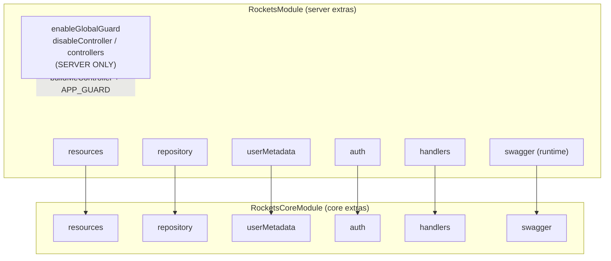
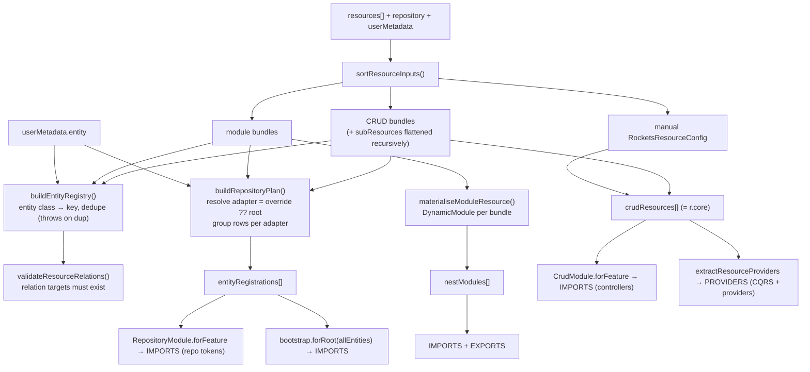
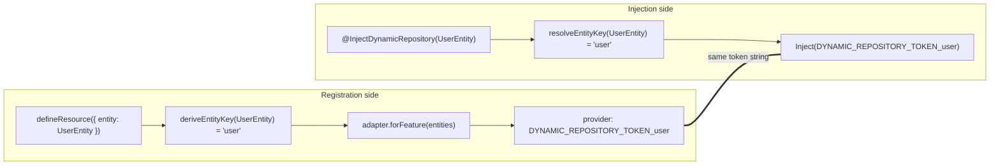
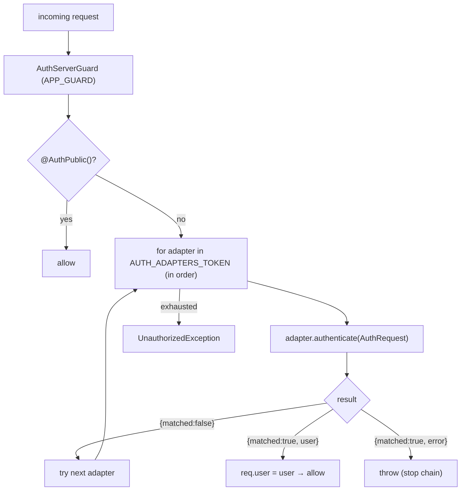
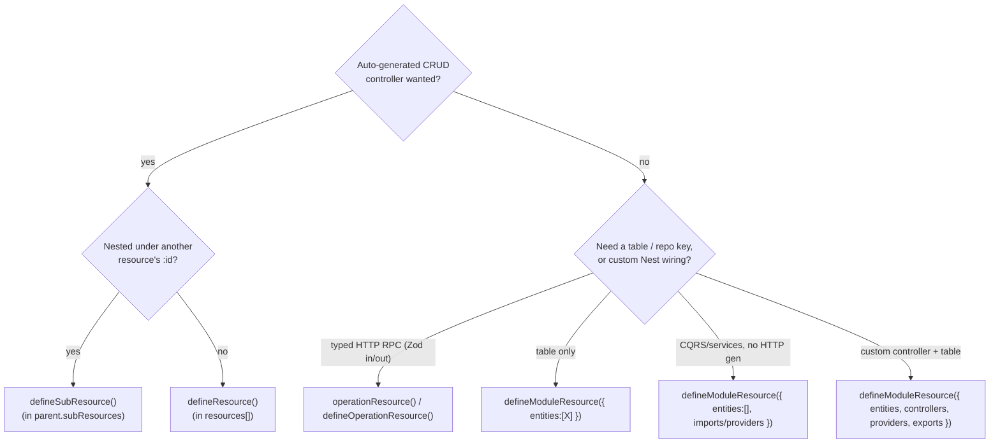

# Rockets — Configuration Entry Point

> Configuration reference for the **1.0-preview DSL**. Field names below match
> the current `packages/*/src/**` (code wins over prose). The original DSL
> rationale, convertibility proof, and change-set live in §12.
> Diagrams are Mermaid — they render on GitHub and in most Markdown viewers.

---

## 0. Mental model (read this first)

You never hand NestJS a tree of modules. You write **declarative bundles**
(`defineResource`, `defineSubResource`, `defineModuleResource`,
`operationResource` / `defineOperationResource`) and a few
top-level fields (`repository`, `userMetadata`, `auth`), pass them to
`createServer({...})`, and the module-definition transform converts that into a
single global `DynamicModule` (controllers, providers, repository tokens, CQRS
handlers, Swagger). Use `RocketsModule.forRoot({...})` directly when a larger
Nest host module must compose Rockets with other imports or providers.

```mermaid
flowchart LR
  subgraph YOU["What you write"]
    R["defineResource()"]
    S["defineSubResource()"]
    M["defineModuleResource()"]
    O["operationResource() / defineOperationResource()"]
    OPT["repository / userMetadata / auth / swagger"]
  end
  YOU --> CREATE["createServer( ... )"]
  CREATE --> FORROOT["RocketsModule.forRoot( ... )"]
  FORROOT --> XFORM["definitionTransform\n(build time)"]
  XFORM --> PLAN["buildAppRegistrationPlan()"]
  PLAN --> DM["one global DynamicModule\nimports / providers / controllers / exports"]
  DM --> APP["Nest App"]
```



**Two layers, one surface.** `@concepta/rockets` (server) is a thin presentation
layer over `@concepta/rockets-core`. Server adds the `/me` routes (built by
`buildMeController` from the `userMetadata` config), the global
guard opt-in, and the `auth` chain; core does the actual resource→module
conversion. `createServer` is the canonical definition-first facade;
`RocketsModule.forRoot` is the lower-level composition surface. Core's
`forRootAsync` is called internally in either case.

---

## 1. The entry point — `createServer` and `RocketsModule`

The options object is split by NestJS's `ConfigurableModuleBuilder` into two
buckets with very different lifecycles:

| Bucket | When consumed | Can be async? | Examples |
|---|---|---|---|
| **runtime options** | at runtime via `RAW_OPTIONS_TOKEN` | yes (`forRootAsync` factory) | `settings`, `swagger` |
| **extras** | at **build time** inside `definitionTransform` | **no** — always static | `resources`, `repository`, `userMetadata`, `auth`, guard flags |

> Consequence: `forRoot` vs `forRootAsync` only changes how `settings`/`swagger`
> resolve. **`resources` / `repository` / `userMetadata` / `auth` are identical
> on both** — they are structural, not async-resolvable.

### 1.1 Full option shape (server — `RocketsModule.forRoot`)

| Field | Type | Req? | Default | Purpose |
|---|---|---|---|---|
| `resources` | `ReadonlyArray<ResourceInput>` | optional | `[]` | The feature bundles (CRUD + module + sub flattened). |
| `repository` | `RepositoryModuleInterface \| RepositoryBootstrap` | optional† | — | Root persistence adapter (TypeORM/Firestore/…). |
| `userMetadata` | `RocketsUserMetadataConfig` | optional | — | `/me` entity + DTOs. When omitted, Rockets does not mount `/me` or register metadata handlers/providers. |
| `auth` | `AuthBootstrap \| AuthBootstrap[]` | optional | `[]` | Auth chain (external adapter and/or built-in). |
| `swagger` | `SwaggerUiOptionsInterface` | optional | — | Doc builder + UI. The **only** runtime field forwarded to core. |
| `settings` | `RocketsSettingsInterface` (empty today) | optional | — | Reserved; no fields yet. |
| `handlers` | `{ upsertUserMetadata?, getUserMetadata? }` | optional | built-ins | Override the user-metadata CQRS handlers. |
| `enableGlobalGuard` | `boolean` | optional | **on‡** | Register `AuthServerGuard` as `APP_GUARD` unless `=== false`. |
| `disableController` | `{ me?: boolean }` | optional | `{}` | Skip the built-in `/me` controller (`buildMeController`). |
| `controllers` | `DynamicModule['controllers']` | optional | — | Replace the auto controller set. |
| `global` | `boolean` | optional | **forced `true`** | `forRoot` always makes the module global. |

† `repository` is optional in the type but persistence resolution throws if an
entity has neither a per-entity override nor a root adapter.

‡ The built-in `defineRocketsAuth()` integration contributes `false` because
its upstream authentication module already owns a JWT global guard. Explicit
server options always win; mixed-auth hosts can opt the Rockets chain back in.

`*-server` / `*-core` split — what server forwards vs keeps:



**Server-only** (never reach core): `enableGlobalGuard`, `disableController`,
`controllers`, `settings`. These drive presentation: the `/me` controller
(`buildMeController`) and the `APP_GUARD` opt-in.

---

## 2. What you pass → what it becomes (the conversion)

The single conversion site is `buildAppRegistrationPlan()`, then
`definitionTransform` fans the plan into the module sections.

### 2.1 Plan shape

```ts
buildAppRegistrationPlan({ resources, repository?, userMetadata? }): AppRegistrationPlan

interface AppRegistrationPlan {
  crudResources:       RocketsResourceConfig[];       // → CrudModule.forFeature (controllers)
  entityRegistrations: RepositoryPersistenceConfig[]; // → RepositoryModule.forFeature (repo tokens), grouped per adapter
  nestModules:         DynamicModule[];               // → module-resource slices
}
```

> The plan carries **no hand-written controllers and no CQRS list** by default.
> Controllers come from CRUD materialisation and from `operationResource`
> generated adapters. CQRS handlers come from imported
> `CrudModule.forFeature` / module slices and are re-extracted later from
> `crudResources[].crud.operations[].queryHandler/commandHandler`.

### 2.2 Pipeline



Where artifacts land in the final `DynamicModule`:

| Artifact | Section | Via |
|---|---|---|
| CRUD controllers | `imports` | `CrudModule.forFeature(resource)` (one per CRUD resource) |
| Module-resource controllers | `imports` | inside each materialised slice |
| Core's own `controllers` | always `[]` | core emits none directly |
| CQRS handlers + resource `providers` | `providers` | `extractResourceProviders()` (deduped) |
| Entities → repo tokens | `imports` | `RepositoryModule.forFeature(group)` per adapter |
| Swagger | `imports` | one `SwaggerUiModule.registerAsync` |
| Re-exports | `exports` | tokens, `AuthServerGuard`, resource providers, module slices |

---

## 3. The dynamic-repository token contract (the key idea)

There is **no shared `*_ENTITY_KEY` constant** between registration and
injection. Both sides independently derive the same string key from the entity
class, so the tokens match.



- `deriveEntityKey`: strip trailing `Entity`, lowercase first char.
  `UserEntity → 'user'`, `PetTagEntity → 'petTag'`, `Order → 'order'`.
- `getDynamicRepositoryToken(key) → \`DYNAMIC_REPOSITORY_TOKEN_${key}\``.
- The concrete repository **provider is 100% adapter-owned** — core only
  forwards `{ module, entities }` groups; the adapter's `forFeature` builds the
  providers. Core never builds repository providers itself.
- String form (`@InjectDynamicRepository('billing/invoice')`) is the escape
  hatch for namespaced keys.

> **Branch note.** `InjectDynamicRepository` and `RepositoryModuleInterface` are
> provided by `@concepta/rockets-repository`, which this branch treats as the
> active repository abstraction (`rockets-core` re-exports them so features
> import from core). No decorator-to-core migration is pending. The dynamic
> token contract above is unchanged: registration and injection both resolve the
> same entity key and token string.

---

## 4. `defineResource()` — top-level CRUD

**Only `entity` is required.** Everything else is derived or defaulted.

### Minimum

```ts
export const petResource = defineResource({
  entity: PetEntity,
  // key   → 'pet'                  (deriveEntityKey)
  // path  → 'pets'                 (pluralized kebab of key)
  // tags  → ['Pets']
  // operations → [List, Read, Create, Update, Delete]
  // no `dto` → no response schema → every route 500s at serialization:
  // upstream refuses to serialize without one. Pass `dto.response`
  // (or use `zodResource`, which derives every schema from one source).
});
```

### Complete (adapted from `examples/sample-server/src/resources/pet/pet.resource.ts`)

```ts
export const petResource = defineResource({
  entity: PetEntity,
  relations: (relation) => [
    relation(PetVaccinationEntity, 'vaccinations'),
    relation(PetTagEntity, 'petTags'),
  ],
  hooks: [PetOwnerStamp, PetOwnerOrSharedHook, PetUniqueRefHook, PetAuditLogHook],
  // Every schema is a NAMED zod schema: `withOpenApi(z.object({...}), 'PetResponseDto')`
  // as the LAST call. The id is the OpenAPI component name.
  operations: {
    list:   { output: petResponseSchema },
    read:   { output: petResponseSchema },
    create: { input: petCreateSchema, output: petResponseSchema },
    update: { input: petUpdateSchema, output: petResponseSchema },
    delete: { soft: true, returnDeleted: true },
    restore:{ returnRestored: true },
  },
  // repository: firestoreRepo,   // optional per-resource adapter override
  subResources: {
    petTags: defineSubResource({ /* see §5 */ }),
  },
});
```

### Field reference (grouped)

| Group | Field | Type | Default |
|---|---|---|---|
| **Identity** | `entity` **(req)** | `Type<E>` | — |
| | `key` | `string` | `deriveEntityKey(entity)` |
| | `path` | `string \| string[]` | pluralized kebab of key |
| | `tags` | `string[]` | `[humanize(key)]` |
| **Schemas** | `dto` | `{ response?, paginated?, create?, update?, replace? }` — named zod schemas (`withOpenApi(schema, id)` last) | `{}` (resource-level fallback; prefer per-op `input`/`output`; `paginated` derives as `${responseId}PaginatedDto`) |
| **Operations** | `operations` | `OperationName[] \| OperationsObject` | `[List, Read, Create, Update, Delete]` |
| | `operations.X` | `{ input?, output?, paginated?, handler?, hooks?, decorators?, path?, transactional?, requestOverride?, responseOverride? }` (`input`→`request.body`, `output`→`response.resource`) | — |
| | `operations.delete` | `+ { soft?, returnDeleted? }` | `soft=false` |
| | `operations.restore` | `+ { returnRestored? }` — only valid with `delete.soft` | — |
| **Relations** | `relations` | array or `(rel) => entries[]` | — |
| **Persistence** | `repository` | `RepositoryModuleInterface` | root `repository` adapter |
| **Hooks** | `hooks` | `RocketsEntityHookForResource<E>[]` | — (auto-registered) |
| **Handlers** | `handlers` | `{ list?, read?, create?, … }` of `Type` | — (auto-registered) |
| | `autoRegisterHandlers` | `boolean` | `true` |
| | `providers` | `Provider[]` — **extras only**, not handlers/hooks | `[]` |
| **AuthZ / Swagger** | `public` | `boolean` | `false` (removes `@ApiBearerAuth`; still passes the global guard) |
| | `decorators` | `ClassDecorator[]` | — |
| | `request` | `CrudRequestConfig` | `{ params: { id: uuid primary } }` |
| **Nesting** | `subResources` | `{ [K in relation prop of E]?: SubResource }` | — |

**Auto-extraction rule:** handlers declared in `operations.X.handler` / `handlers.X`
become `queryHandler` (List/Read) or `commandHandler` (writes) and are
auto-registered as providers (with `hooks`). **Do not also list them in
`providers`** — `providers` is for extra services only.

**Flat config (no `crud.crud`):** the returned `core` is
`RocketsResourceConfig = CrudModuleForFeatureOptionsInterface + { providers? }`,
i.e. exactly one `crud` level: `{ crud: { controller, operations }, providers }`.

---

## 5. `defineSubResource()` — nested under a parent

A sub-resource is **never** placed in `resources[]`. It is a value inside a
parent's `subResources` map, keyed by a **real relation property of the parent
entity** (typo → compile error). The parent materialises it into a peer CRUD
resource with a composed path and auto-injected `PathScopeGuard` + `PathScopeHook`.

```text
parent path  +  :<parentKey>  +  segment
   /pets      +     /:petId      +    /tags     →   /pets/:petId/tags
```

### Minimum (secure by default)

```ts
defineSubResource({ entity: PetTagEntity })
// owner defaults to 'userId', scope on, FK derived (pet+Id → :petId).
// → /pets/:petId/tags with FK filter + ownership guard, zero config.
```

### Complete (verbatim shape from `pet.resource.ts`)

```ts
petTags: defineSubResource({          // key 'petTags' must be a PetEntity relation prop
  entity: PetTagEntity,
  segment: 'tags',                    // → /pets/:petId/tags (default would be 'pet-tags')
  tags: ['Pet Tags'],
  owner: 'userId',                    // ownership column (default 'userId'; `false` = public)
  // scope: false,                    // would disable FK filter+stamp+guard entirely
  // parentKey: 'animalId',           // FK + URL param override (default <parent>Id)
  // parentPk: 'companyId',           // parent PK column for the guard (default 'id')
  reloadAfterCreate: true,            // opt-in AfterCreateReloadHook (eager relations on create)
  hooks: [PetTagTagIdExistsHook],
  relations: (relation) => [
    relation(() => PetEntity, 'pet'),
    relation(() => TagEntity, 'tag'),
  ],
  operations: {
    list:   { output: PetTagResponseDto },
    read:   { output: PetTagResponseDto },
    create: { input: PetTagCreateDto, output: PetTagResponseDto },
    delete: {},
  },
})
```

### Field reference (sub-specific; inherits all `defineResource` fields except `path`)

| Field | Type | Req? | Default |
|---|---|---|---|
| `entity` | `Type<E> \| (() => Type<E>)` | **yes** | — (thunk allowed for circular imports) |
| `parentKey` | `string` | no | `${parentEntityKey}Id` (e.g. `petId`) — URL param **and** FK column |
| `parentPk` | `string` | no | `'id'` — parent PK column the guard looks up |
| `parentSelect` | `readonly string[]` | no | projection for the guard's parent lookup (default: pk only, or the full row when the parent has hooks) |
| `segment` | `string` | no | `kebab-case(mapKey)` — URL segment |
| `owner` | `string \| false` | no | `'userId'` — ownership column; `false` drops the guard (public) |
| `scope` | `boolean` | no | `true` — master switch (FK filter/stamp + guard); `false` = unscoped |
| `reloadAfterCreate` | `boolean` | no | `false` |
| *(inherited)* | `dto`, `operations`, `relations`, `hooks`, `handlers`, `providers`, `subResources`… | no | — |

An all-server-stamped sub-resource — FK from the path, owner from the
actor, ids and timestamps from a hook — is created with `POST {}`. The
create input schema is the contract: a body that validates to `{}` is a
valid create (generated resources run on `RocketsCrudAdapter`, which does
not repeat upstream's bare `400` for an empty validated payload).

### Which parent-side hooks run during path scoping

`PathScopeGuard` performs one parent lookup per nested request, and that
lookup runs the **parent resource's own `hooks`** — the classes declared in
the parent's `defineResource({ hooks })`. A parent that its own routes
cannot see (soft expiry, retention, tenant scope expressed as a
`beforeFindOne` / `afterFindOne` filter) is a `404` on every nested route
too, not just on the parent's routes.

**What the replay context carries.** The lookup is presented to those
hooks as the parent's OWN read: `getCrudContext(ctx)` returns a context
with `entity` = the parent's key, `operation: Read`, and `params` = the
request's route params with `id` bound to the parent row being looked up.
A hook gated on `if (!getCrudContext(ctx)) return options;` — the shape
this codebase documents — therefore filters here exactly as it does on the
parent's own routes. That also makes three-level nesting behave: a
grandchild's guard replays the middle resource's `PathScopeHook`, which
needs `params[:parentId]` to bind the middle row to ITS parent.

The parent's primary param is bound by NAME, taken from the parent's own
`request.params` (default `id`) — a resource that declares a different
primary still sees its hooks fire.

**What it deliberately does not carry:**

- **No transaction.** Nest runs guards ahead of interceptors, so no
  operation transaction exists when the guard runs. The lookup is a
  pre-check, never a participant. See §12 and issue #60 for the wider
  `ctx` / `TransactionScope` seam.
- **No `query`.** The guard applies no filter, sort or pagination of its
  own, so the parsed query is empty rather than the child route's.
- **Not the request's `AppContextHost`.** `defineOverlay` is
  first-write-wins and the hook overlay interceptor has not run yet;
  writing to the request here would pin the parent's hooks for the whole
  request and the child's own hooks would never attach.

Other constraints worth knowing:

- The parent's hooks are entity-scoped by `@EntityHook({ entity })`, so
  hooks bound to a different entity never fire on this lookup.
- **A parent hook that throws now surfaces on nested routes.** It did not
  fire here before. A `Before*` hook that throws an `HttpException` is
  wrapped by the upstream membrane and reaches the client as a `500` —
  throw a `RepositoryQueryException` with an `httpStatus` instead when the
  status matters.
- **Projection cost.** With no parent hooks the lookup reads the primary
  key only. With hooks it reads the FULL parent row — including eager
  relations — because an `afterFindOne` hook may inspect a column a
  narrow projection would omit, and nothing declares which columns a hook
  reads. Set `parentSelect: ['id', 'expiresAt']` on the sub-resource when
  you know what your hooks need.
- **`owner: false` drops the guard entirely**, and with it the parent-hook
  replay. A sub-resource that opts out of the ownership check also opts
  out of parent-side visibility.
- Sub-resource hooks (`PathScopeHook`, the child's own `hooks`) are
  unaffected — they still attach normally to the child's controller.

---

## 6a. `operationResource()` — typed non-CRUD endpoints (issue #43 / #50)

Use when you need **RPC-style** routes beside CRUD — health checks, actions,
reports — without hand-rolling a Nest controller. Zod `input` / `output`
become named OpenAPI components validated by the same per-route Standard
Schema pipe generated CRUD uses. Wire the bundle into `resources[]` like any
other resource.

```ts
import { operationResource } from '@concepta/rockets-core/zod';
import { z } from 'zod';

export const ops = operationResource({
  path: 'ops',
  tags: ['Ops'],
  public: true, // class-level @AuthPublic; individual ops cannot be more private
  operations: (op) => ({
    ping: op.read({
      path: '', // root mount → GET /ops (default path is the operation key)
      output: z.object({ ok: z.boolean() }),
      handler: () => ({ ok: true }),
    }),
    shout: op.write({
      status: 201, // default is 200
      input: z.object({ text: z.string().min(1) }),
      output: z.object({ text: z.string() }),
      handler: ({ input }) => ({ text: input.text.toUpperCase() }),
    }),
    list: op.read({
      path: 'items', // GET /ops/items (or rename the key to `items` and omit path)
      output: z.array(z.object({ id: z.string() })),
      handler: () => [{ id: '1' }],
    }),
    // output: false opts out of response validation (explicit)
    purge: op.delete({
      status: 204,
      output: false,
      handler: () => undefined,
    }),
  }),
});

// Path params: resource `params` must list every :name on `path`.
// Nested op segments (e.g. key `transfer` → /pets/:petId/transfer) stay in ctx.params.
export const petTransfer = operationResource({
  path: 'pets/:petId',
  params: z.object({ petId: z.uuid() }),
  operations: (op) => ({
    transfer: op.write({
      input: z.object({ newOwnerId: z.uuid() }),
      output: z.object({ id: z.string(), userId: z.string() }),
      handler: TransferHttpHandler, // injectable class with handle(ctx)
    }),
  }),
});
```

| Builder | Allowed methods | Default method | Default status |
|---|---|---|---|
| `op.read()` | `GET` | `GET` | `200` |
| `op.write()` | `POST` / `PUT` / `PATCH` | `POST` | `200` (set `status: 201` when creating) |
| `op.delete()` | `DELETE` | `DELETE` | `200` |

**Authoring rules (#50).** `operations` is a **callback** so base-path
`:params` type `ctx.params`. Operation path defaults to the **key verbatim**
(not kebab-cased); use `path: ''` for a root-mounted route. Input sourcing
follows HTTP method (`GET`/`DELETE` → query; body otherwise). **`output` is
required** — pass a schema (validated + documented) or `output: false`
(explicit opt-out). Optional resource-level `params: z.object({...})`
validates named path params at request time (400). Keys must be `:params`
on the resource `path`; extra Nest params from an operation path (not in
the schema) are preserved.
Structured cross-resource route collisions with CRUD/Sub fail in
`buildAppRegistrationPlan` (not silently at runtime). This planner check is
limited to Rockets-owned resource declarations; use
`validateRegisteredRoutes(app)` after `app.init()` when you need to audit the
actual Nest adapter routes with global prefix, versioning, and hand-written
controllers applied. Status `204` with an output schema is rejected at define
time. The return value exposes `authored` (typed pending ops) for inference
consumers; function handlers get full `ctx` typing — injectable class `handle`
methods do not (TypeScript method bivariance).
Class handlers can be passed as `handler: TransferHttpHandler` or explicitly as
`handler: { useClass: TransferHttpHandler }`; a matching local provider in
`providers` wins over auto-registration.

**Auth / ACL.** Resource `public: true` opens the whole controller. On a secured
resource, mark individual ops with `public: true`. Setting `public: false` on
an op under a public resource is rejected at boot. Operation resources accept
`acl` at resource and operation level like CRUD resources do — see §5a; an
operation with neither `acl` nor a manual grant decorator is open to any
authenticated user, because upstream's check-access handler returns `true`
when no grant metadata exists. Omitting `input` means the raw body/query
reaches the handler unvalidated.

**Validation.** The generated controller carries a class-level
`StandardSchemaValidationPipe(rocketsSchemaValidation)`: the body is
`@Body({ schema })`, the query `@Query({ schema })`, the params
`@Param({ schema })` — a `400` carries `details[]` like every other Rockets
route. Responses are validated against `output` when present (undeclared
keys stripped); handler/`output` mismatches and a `null` / `undefined`
result return **500** (server bug), not 400. Query-string inputs are strings
— use `z.coerce.number()` / `z.coerce.boolean()` when needed. `output`
accepts `z.object(...)` or `z.array(...)`, and must strip (no
`.passthrough()`). Duplicate `method`+`path` pairs inside one resource fail
at boot.

**Hand-written routes carry the same pipe — and the boot checks it.** Nest
installs no pipe for `@Body/@Query/@Param({ schema })`: without a
`StandardSchemaValidationPipe` on the parameter, the handler or the class,
the schema is documented in OpenAPI and validated by nothing. The route
audit (`RouteAuditService`, always registered) fails the boot with
`requireSchemaPipe` naming the controller, handler and parameter. A route
validated by a pipe of its own that the audit cannot recognise is exempted
through `routePolicy.allow` / `allowControllers`.

When an operation declares `input`, the request payload must be a plain JSON
object. An array, a scalar, or a non-plain object (a `Buffer` from a raw body
parser, for instance) returns **400** rather than being narrowed to `{}` —
substituting a valid value for an invalid one is not something a validation
boundary should do quietly. A MISSING body is still `{}`, so a `POST` with no
payload against an all-optional `input` stays legal.

**OpenAPI.** A body input is a named component
(`<Resource>_<Method>_<Key>Input`,
`$ref`'d from the request body); a query input and the resource `params`
schema are documented one parameter per property; the response `$ref`s
`<Resource>_<Method>_<Key>Output`. Two schemas that would claim the same
component id fail at boot. The id is derived from the resource path, the
method, the operation key and the operation's own path, and that transform
folds punctuation and casing together — `foo-bar` and `fooBar` both yield
`FooBar`. One schema instance reused across several operations is fine: the
check compares instances, not names.

Cursor, binary, raw JSON, and idempotency are follow-ups on issue #43.
SSE now has a first-class builder (§6c below); Range/partial content is
issue #52's still-open half. The OpenAPI contract-export scaffold (§6b)
is that follow-up's answer for external clients.

Lower-level escape hatch: `defineOperationResource({ path, operations: {…} })`
with precompiled DTO classes.

---

## 6b. Exporting a stable OpenAPI contract (issue #54)

`SwaggerUiService` already builds one OpenAPI document from whatever CRUD
zod resources and `operationResource` ops an app registers — the same
document `swagger`/`swagger-ui` serves. The gap issue #54 closes is not
generating that document; it is **pinning it**, so an unintended change to
the wire contract fails CI instead of only showing up as a diff nobody
reviewed.

### The pattern

A vitest e2e spec boots the app, builds the document **through the app's own
document-building code path**, and either regenerates a committed
`contract.json` (opt-in, via an env var) or diffs the fresh document against
it byte-for-byte:

```ts
const document = createSampleServerOpenApiDocument(app);
const generated = stableContractJson(document);

if (process.env.CONTRACT_UPDATE === '1') {
  writeFileSync(contractPath, generated);
} else {
  expect(generated).toBe(readFileSync(contractPath, 'utf8'));
}
```

That helper is the important part. A document rebuilt from a bare
`SwaggerModule.createDocument(app, builder.build())` is **not** what a real
app serves: only `SwaggerUiService.createDocument` installs the Rockets
schema converter that turns every named schema into a
`components/schemas/<id>` `$ref`. Pinning the bare document would pin a
contract nobody is served.

So each app owns one `src/swagger/create-openapi-document.ts` that `main.ts`
and its contract spec both call, and rockets-core exposes the shared seam
underneath it:

```ts
// packages/rockets-core — builds the document `setup()` serves, no UI mount
swaggerUiService.createDocument(app);
```

`SwaggerUiService.setup()` now routes through `createDocument()` too, so
"the pinned document" and "the served document" are the same call by
construction rather than by convention.

### The two pinned artifacts

Both example apps pin a contract, because they cover different halves of
issue #54's acceptance criteria:

| App | Contract | Covers |
|---|---|---|
| `examples/sample-server` | `examples/sample-server/contract.json` | zod CRUD (`zodResource`), zod sub-resources (`zodSubResource`), `operationResource` non-CRUD ops, plus class-based `defineResource` in the same document |
| `examples/sample-server-auth` | `examples/sample-server-auth/contract.json` | class-based `defineResource` + the full built-in auth surface |

Regenerate after an intentional API change:

```bash
yarn sample:contract:export        # writes examples/sample-server/contract.json
yarn sample:contract:check         # verifies it's pinned
yarn sample-auth:contract:export   # writes examples/sample-server-auth/contract.json
yarn sample-auth:contract:check    # verifies it's pinned
```

Each `contract:*` script builds the workspace packages and the example first
(`contract:build`), so a regeneration can never pin a document generated
from stale `dist`.

### Canonical key order

`stableContractJson` sorts object keys before serializing (array order is
preserved — it *is* significant in `required`, `enum`, `parameters`,
`allOf`). This is not cosmetic. `SwaggerModule` assigns schema properties in
whatever order its code path happens to take, and that order is **not stable
across toolchains**: the `/admin/audit-logs` enum query parameter serializes
as `{"type","enum"}` when the app runs under vitest/swc and `{"enum","type"}`
under ts-node/tsc. A raw `JSON.stringify` pin reports drift on a document
whose API did not change. Sorting first makes the check answer the question
it is actually asking.

Verified end to end: booting `examples/sample-server` with `yarn sample:once`
and canonicalizing what `GET /api-json` returns reproduces
`examples/sample-server/contract.json` exactly.

### What is deliberately not pinned

The OpenAPI `info` block is per-deployment configuration —
`SWAGGER_UI_TITLE`, `SWAGGER_UI_VERSION`, `SWAGGER_UI_DESCRIPTION`,
`SWAGGER_UI_CONTACT_*`, `SWAGGER_UI_LICENSE_*` all feed it. Both contract
specs clear every `SWAGGER_UI_*` variable before booting, so the pinned
`info` block is always the built-in default. Without that, anyone with one of
those exported in their shell gets a drift failure that is not drift.

### Why this, not a typed client

Issue #54 asked for one v1 deliverable, not both a contract artifact and a
generated client. A `contract.json` export needed no new dependency — the
document-building and structural-validation logic
(`test/openapi-contract.e2e-spec.ts`, `@apidevtools/swagger-parser`)
already existed and were already proven; the only new work was pinning the
artifact and wiring the drift check. A typed client would mean adopting a
new codegen tool with no existing precedent in this repo — a bigger, riskier
v1 for an issue whose own acceptance criteria says not to boil the ocean.
Nothing here blocks adding one later against the same `contract.json`.

### CI

No new workflow step was needed: `release-readiness.yml`'s `release-gates`
job already runs `yarn samples:test:e2e` (→ `sample:test:e2e` and
`sample-auth:test:e2e`) on every PR, and vitest picks up both new
spec files automatically. Contract drift therefore shows up as a **failing
job on the PR before merge**.

Be precise about what that buys you: `release-gates` is not configured as a
GitHub *required status check* — `main` has no branch protection today, so
the job reports, it does not block. Making drift merge-blocking is a
repository-admin change (enable branch protection on `main` and mark
`release-gates` required), not something this scaffold can do on its own.

## 6c. `op.sse()` — Server-Sent Events (issue #52, v1)

A Server-Sent-Events operation looks like any other `operationResource`
op — same resource, same auth/`public`/`acl`, same query-param
validation — except the handler returns an `Observable<MessageEvent>`
instead of a JSON value, and there is no `output` to declare:

```ts
import { operationResource } from '@concepta/rockets-core/zod';
import { Observable } from 'rxjs';
import type { MessageEvent } from '@nestjs/common';
import { z } from 'zod';

export const notifications = operationResource({
  path: 'notifications',
  operations: (op) => ({
    stream: op.sse({
      input: z.object({ channel: z.string() }),
      handler: (ctx): Observable<MessageEvent> =>
        new Observable((subscriber) => {
          const unsubscribe = subscribeToChannel(ctx.input.channel, (msg) =>
            subscriber.next({ data: msg }),
          );
          return unsubscribe; // teardown when the client disconnects
        }),
    }),
  }),
});
```

That `return unsubscribe` is not optional decoration. Nest unsubscribes
the Observable when the client disconnects, but an Observable with no
teardown has nothing to unsubscribe *from* — whatever the factory
started (a timer, a listener, a subscription) outlives the connection,
once per request. A hand-built `new Observable(...)` must return a
teardown function, or complete; an operator-built stream (`interval`,
`fromEvent`, a Subject's `asObservable()`) already carries one.

### What's shared with every other operation, and what's not

One `responseMode` seam in the generated controller
(`build-operation-controller.ts`) is the entire difference: it applies
Nest's native `@Sse()` instead of `@Get()` and skips the JSON
output-DTO step. Everything upstream — guards, `public`/`acl`, query
validation, the exceptions filter for a REJECTED request — is the exact
same pipeline every other operation goes through, because it all runs
**before** the stream starts. A `401`/`400`/`403` on an SSE route looks
like a normal JSON error response; only a request that gets past all of
that opens the stream.

Two things `op.sse()` does not expose, deliberately: `output` (the
response body IS the event stream, never a validated JSON value) and
`transactional` (holding a database transaction open across a
connection that may run indefinitely is not something to make one flag
away).

### The registered route must match the declared route

Nest's route decorators are unmerged `Reflect.defineMetadata` writes and
`applyDecorators` runs its list **in order**, so a route decorator
appended through `operation.decorators` silently takes over the method
slot, the path slot, or both — `@Sse()` and `@Get()`/`@Post()` all write
`METHOD_METADATA` *and* `PATH_METADATA`.

That matters beyond SSE. Every other route protection here reads the
**declared** `method`/`path`: the duplicate-route check and the
planner's cross-resource collision validator. A hijacked route is
therefore not merely wrong, it is *invisible* — the app serves an
address no audit knows about.

So after every decorator has run, the generated controller reads the
metadata back and **throws at definition time** when the registration
disagrees with the declaration, for **every** operation:

| Situation | Why it is rejected |
|---|---|
| registered method ≠ declared method | a `decorators` entry overwrote the generated route decorator |
| registered path ≠ declared path | same, on the sibling slot — `op.sse({ path: 'a', decorators: [Get('b')] })` keeps a legal method and moves only the address |

On top of that, SSE-specific rules:

| Situation | Why it is rejected |
|---|---|
| an SSE op *declares* a non-`GET` method | `@Sse()` always registers GET, so route audits would file the route under the wrong method (reachable via `defineOperationResource`) |
| a non-SSE op carries `@Sse()` | core would still run the JSON output-schema step over the Observable |
| an SSE op declares an `output` schema | there is no JSON body to validate; the schema would be silently ignored |
| an SSE op carries `Transactional()`, on the operation **or on the resource** | see below |

An SSE route is therefore always `GET` — the only method a browser's
native `EventSource` can issue.

`Transactional()` on an SSE operation is rejected rather than allowed
to be a silent no-op: the handler returns its Observable immediately,
so the transaction the interceptor opens commits before a single event
is emitted. Resource-level `decorators: [Transactional()]` reaches every
route on the generated controller, so it is caught the same way. If a
specific emission needs a transaction, open one inside the stream with
`TransactionScope.run` (§8a).

### Error after the stream has started

Once the first event is written, headers are already sent — a later
handler error can no longer become an HTTP status code, and it never
reaches `RocketsCoreExceptionsFilter`. Nest's own SSE response
controller writes `{ type: 'error', data: err.message }` onto the open
connection instead.

Core therefore masks that error **before Nest sees it**, using the
filter's own exported chain walkers and then the same decision it makes
for a JSON response.

Unwrapping first is the load-bearing part. The repository/CRUD layers
wrap a hook's `HttpException` as a `RepositoryQueryException`, which
extends `RuntimeException` and carries **no** `httpStatus` — judged at
the top level, a hook's `403` looks like an unclassified 5xx. The filter
never judges at the top level; it walks `context.originalError` first,
and so does this path:

| Thrown from the stream (after unwrapping) | What the client receives |
|---|---|
| an `HttpException` | its own message, at any status — author-chosen, exactly as in a JSON response |
| a `RuntimeException` with a `safeMessage` | that `safeMessage` |
| a `RuntimeException` at 5xx without one | `Internal Server Error` |
| anything else (a plain `Error`, a driver failure) | `Internal Server Error` |

The real error is logged server-side in every masked case, and 5xx
`HttpException`s are logged too even though their message passes
through. Without this, a `public: true` stream — a first-class pattern
here — could hand an anonymous client an internal error verbatim.

Because the unwrapped exception itself is what travels (rather than a
rebuilt one), a failure raised **before the first event** still reaches
the exceptions filter and still resolves the status it always did: a
wrapped `403` is a `403`, not a `500`.

**If a handler wants a specific, safe-to-leak mid-stream message**, say
so explicitly: throw an `HttpException` (or a `RuntimeException` with a
`safeMessage`) rather than a bare `Error`. A bare `Error`'s message is
treated as internal, because that is the only assumption that is safe by
default.

Beyond the message: design handlers so a mid-stream failure is something
the client can *detect* (a reconnect, a final sentinel event) rather than
something the server can still turn into a status code.

### Not in this PR: Range / partial content

Issue #52 also asks for HTTP Range support (byte-range media/file
responses, `206 Partial Content`). It needs new plumbing with no
existing precedent here — manual `Content-Range`/`Accept-Ranges`
handling, non-passthrough `@Res()`, `416` on an invalid range — and
deserves its own review surface rather than riding in behind SSE.
Tracked as a follow-up.

---

## 5a. `acl` — access control on resources and operations (issue #51)

Upstream's check-access handler returns `true` for any route with **no
grant metadata**. A forgotten `AccessControl*` decorator is therefore not
a broken route — it is an *open* one, authenticated but ungranted, and no
test notices. `acl` moves that from a per-route chore to a bundle-level
declaration the framework materialises and validates.

Rules stay app-owned. This wires decorators and registers query services;
it does not generate `acRules`, and possession (`own` vs `any`) is still
decided by your `CanAccess` service.

```ts
defineResource({
  entity: PetEntity,
  path: 'pets',
  acl: { resource: 'pet', query: PetAccessQueryService },
  operations: {
    list: {},                 // → read
    read: {},                 // → read
    create: {},               // → create
    update: {},               // → update
    delete: {},               // → delete
    // restore: { acl: false } // authenticated, deliberately ungranted
  },
});
```

Action per operation: `list`/`read` → **read**, `create` → **create**,
`update`/`replace` → **update**, `delete`/`restore` → **delete**.
(`AccessControlReadMany` and `AccessControlReadOne` emit the same grant
upstream, so there is one action per verb, not one per decorator.)

### `operationResource`

A non-CRUD write's HTTP verb says nothing about intent —
`POST /pets/:id/transfer` is an update, not a create — so `op.write` has
**no default** and must declare one:

```ts
operationResource({
  path: 'pets/:petId',
  acl: { resource: 'pet', query: PetAccessQueryService },
  operations: (op) => ({
    transfer: op.write({ acl: 'update', input: …, output: …, handler: … }),
    stats:    op.read({ /* infers read */ output: …, handler: … }),
  }),
});
```

### Boot-time rules

| Condition | Result |
|---|---|
| Bundle declares `acl`, app configures no root `accessControl` | **throw** |
| `operations.X.acl` action with no resource-level `acl` | **throw** |
| `op.write` with no `acl` on an ACL-enabled operation resource | **throw** |
| `public: true` on an operation that also carries a grant | **throw** |
| `accessControl.enforceGrants: true` and a **generated** authenticated op carries no grant | **throw** |
| `accessControl.enforceGrants: true` with no root `accessControl` | **throw** |

`acl.query` services are collected across every bundle and merged into
`AccessControlModule.forRoot({ queryServices })` — they must land on that
module specifically, because the upstream guard strict-resolves from its
own host module. You no longer declare a query service and then 500 at
request time because nobody registered it.

### One `CanAccess` per route, and why `query` really overrides

The service is stamped on the **route**, never on the controller: the
operation's own `query` when it declares one, otherwise the
resource-level default.

That is not a style choice. Upstream reads query metadata with
`getAllAndMerge([getClass(), getHandler()])` and then loops the resulting
services, **breaking on the first one that returns `true`** — class-level
first. A class-level default plus a method-level "override" is therefore
an OR in which the *permissive* service wins, and an operation could
never tighten. Stamping exactly one entry per route is what makes
`acl: { action, query }` mean what it says.

A consequence worth knowing: a resource-level `query` is consulted on
**every** route of the resource, including collection routes that have no
row to own. Return early there (`if (!params.id) return true`).

### Sub-resources do not inherit `acl`

A sub-resource is a different resource in your `acRules`. It declares its
own `acl: { resource: 'widget-note' }`; nothing is taken from the parent's
`acl.resource`. If it declares none, it has no grants — and shows up in
the `enforceGrants` report under its own key.

### `enforceGrants` — scope and why it is opt-in

With it on, a route the planner generates that is authenticated and
carries no grant fails the boot instead of serving.

**It covers exactly what the planner generates:** CRUD bundles (including
sub-resources, which are flattened recursively) and operation resources.
It does **not** cover:

- `defineModuleResource({ module: { controllers } })` controllers
- hand-built `RocketsResourceConfig` entries
- controllers owned by other packages — the `/me` controller
  (`buildMeController`) in `rockets-server`, every `rockets-server-auth`
  controller

Those routes never reach the planner, so a passing boot says nothing
about them. Treat `enforceGrants` as "the generated surface is covered",
not "the app is covered".

It defaults to **off** because a hand-written `AccessControl*` entry in a
bundle's `decorators` cannot be detected **at plan time**: the CRUD
controller is built downstream of the planner, so the grant metadata does
not exist yet, and the only way to read it early would be to apply the
consumer's opaque decorator list a second time. Turning the default on
would reject every working manual-grant app. A bootstrap-time sweep over
discovered routes would close both this and the scope gap above.

`acl` plus a manual `AccessControl*` decorator on the same operation is
**not** detected either, but for a different reason, and the outcome is
not a coin flip. Upstream's grant metadata is a plain `SetMetadata` write
read with `reflector.get(...)`, so the two never merge — the last write
wins. The generated route applies the operation's own `decorators` first
and the `acl`-derived grant last, so **`acl` overwrites a hand-written
`AccessControlGrant`**, and a manual grant deliberately tighter than the
inferred action is discarded silently.

For operation resources this is decidable: the route builder owns the
single `applyDecorators` call and could read the metadata back between
the two pushes, with no re-application of consumer code. It is simply not
implemented. For CRUD resources the plan-time argument above still holds.
Either way: use one or the other per bundle.

### `public` and `acl` do not mix

A public route carries no authenticated user, so role resolution yields
nothing and every grant check fails — the route would 403 for everyone.
Declaring both on the same operation throws at definition time. Opt the
operation out with `acl: false` if a public resource needs one ungranted
route.

### `rockets-server-auth` registers its own `AccessControlModule`

`defineRocketsAuth` wires access control through its own
`buildAccessControlImport` call, which does not receive the collected
query services. In an app composing auth **and** `RocketsCoreModule` with
`accessControl` on both, `acl.query` auto-registration applies to the
core registration only — list auth-side services in that module's
`queryServices` explicitly.

## 5b. `TenantScopeHook` — fail-closed tenant row scoping (issue #69)

Complements `acl` from §5a: `acl` decides which ACTIONS an actor may
perform (`read`, `create`, …); this decides which ROWS an action can
touch. `acl` alone lets an actor authorized to `read` see every OTHER
tenant's rows on `GET /pets` — there is nothing in the grant that says
"only this tenant's."

`OwnerScopeHook` (§3, "Scope rows to the authenticated user" in the
README) already solves the SINGLE-owner case: a column equals
`actor.id`. `TenantScopeHook` is for an actor who belongs to a set of
tenants resolved at request time — and, unlike `OwnerScopeHook`, is
**fail-closed**: `OwnerScopeHook` deliberately leaves options unchanged
when there is no actor (an unauthenticated request on a protected route
already failed upstream, so a public route reaching the hook should not
be scoped). `TenantScopeHook` disagrees on purpose — no actor, or a
`resolve` that returns `[]`, both produce a WHERE clause matching NOTHING,
never an unfiltered query. This is the fail-open gap #69 exists to close:
"no actor / no resolved scope → empty set, never a full dump."

```ts
import { TenantScopeHook, TenantStampHook } from '@concepta/rockets-core';

// One scope object, given to BOTH hooks. A read-side and a write-side
// resolver that disagree is the bug this pairing exists to prevent.
const shelterScope = {
  tenantKey: 'shelterId' as const,
  resolve: (actor) => shelterIdsFor(actor), // [] when the actor owns none
};

defineResource({
  entity: PetEntity,
  hooks: [
    TenantScopeHook.for(PetEntity, shelterScope),
    TenantStampHook.for(PetEntity, shelterScope),
  ],
});
```

Coverage: `list` (`beforeFindAndCount`) and `read`/`update`/`delete`
(`beforeFindOne`) — the same lifecycle keys `OwnerScopeHook` hooks.
A row outside the resolved set is excluded by the query itself, so it
surfaces as `404` (never found), not `403` — confirming a row EXISTS to an
actor who cannot see it is its own leak.

### `TenantScopeHook` does NOT protect the tenant column on writes

It rewrites `where` clauses and nothing else. **On its own it does not
stop an actor writing another tenant's id into the tenant column:**

- `POST /pets` with `{"shelterId":"someone-elses"}` creates a row in
  another tenant — `create` issues no `find`, so no lifecycle key the
  scope hook implements fires at all.
- `PATCH /pets/:id` with `{"shelterId":"someone-elses"}` MOVES the actor's
  own row out of their tenant. `beforeFindOne` correctly scopes the
  lookup, but nothing inspects the update PAYLOAD, so the write lands.

`TenantStampHook` is the write-side half, enforcing the SAME resolved set
on `beforeCreate`/`beforeUpdate`:

| Incoming `tenantKey` value  | Result                                      |
| --------------------------- | ------------------------------------------- |
| in the resolved set         | passes through unchanged                    |
| any other value             | `403` — rejected, never silently rewritten  |
| absent, resolved set has 1  | stamped with that id (create only)          |
| absent, resolved set has 0  | `403`                                       |
| absent, resolved set has 2+ | `400` — ambiguous, the caller must say which|
| no actor in context         | `401`                                       |

A forbidden value is **rejected, not overwritten** — the opposite of
`OwnerStampHook`, deliberately. There is exactly one legal owner id
(`actor.id`), so silently correcting it is unambiguous; there can be
several legal tenant ids, so silently picking one would persist the row
somewhere the caller neither asked for nor learned about. On `update` an
absent tenant key is left absent rather than stamped, since the scoped
`findOne` already proved the row is inside the actor's set.

> **`OwnerStampHook` is not a substitute here.** It stamps `actor.id`. An
> actor's user id is not one of their tenant ids, so aiming it at a tenant
> column writes the wrong value and corrupts the column. Earlier revisions
> of this section advised exactly that; it was wrong.

Both stamp hooks need `RocketsCoreExceptionsFilter` registered
(`{ provide: APP_FILTER, useClass: RocketsCoreExceptionsFilter }`). The
upstream membrane wraps whatever a hook throws in a
`RepositoryQueryException`, and that filter is what walks the chain back
to the real 4xx. Without it the row is still not written, but the client
sees a generic `500`.

### Custom resource `key` — the hook binding is checked at boot

`@EntityHook({ entity })` matches on `deriveEntityKey(entity)`, while the
repository adapter stamps the resource's REGISTRATION `key` onto the hook
context, and matching is an exact string compare. So

```ts
defineResource({ entity: PetEntity, key: 'pets', path: 'pets', hooks: [...] })
```

registers the entity as `pets` while the hook matches `pet`. That hook
would never fire — for a scoping hook, a silent total fail-open.

`buildAppRegistrationPlan` now rejects this at boot, naming the key the
entity is actually registered under. Either drop the explicit `key`, or
pass the key the resource uses to the hook:

```ts
TenantScopeHook.for(PetEntity, { ...shelterScope, entityKey: 'pets' });
```

The check covers generated CRUD bundles — resource-level `hooks`,
per-operation `operations[op].hooks`, and sub-resources. Hooks registered
as bare providers on a `defineModuleResource({ module: { providers } })`
slice, or applied by a hand-written `@UseHooks`, are outside what the
planner can see, so a clean boot says nothing about them.

The empty-set case is deliberately NOT expressed as `Where.in(tenantKey,
[])`: several SQL engines (TypeORM's own `In([])` historically included)
do not reliably treat an empty IN-list as "match nothing." Instead it
composes `Where.isNull(tenantKey)` AND `Where.notNull(tenantKey)` — a
contradiction no backend can satisfy, expressed with the same portable
`Where` DSL rather than a raw per-adapter escape hatch.

`TenantScopeHook.for()` is intentionally NOT cached per `(entity,
tenantKey)` the way `OwnerScopeHook.for()` is — two calls could
legitimately carry different resolvers (different tenant semantics for
the same column across two resources), and caching by that key would
silently keep whichever resolver arrived first. Call it once per
resource.

### 6d. Background job dispatch (issue #53)

`JobDispatchServiceInterface` (`enqueue` / `claim` / `heartbeat` /
`complete` / `fail`) under `JOB_DISPATCH_SERVICE_TOKEN` — named tasks
with dedupe, lease-based claiming, and at-least-once delivery, so apps
stop reimplementing this over `@InjectDynamicRepository` for every
product. Core ships one adapter, `InProcessJobDispatchService`
(in-memory, single-process) for tests and samples; a production app
implements the same interface against Cloud Tasks, Bull, SQS, or
whatever it already runs — no queue vendor is a core dependency, the
same rule as the storage SDK for the file upload seam.

The common shape is an `operationResource` write op that enqueues and
returns immediately (`202` + job id), with a worker claiming jobs
elsewhere — a worker is not a route, so `claim`/`heartbeat`/`complete`
are called from wherever the app runs its background process, not from
generated HTTP code:

```ts
import {
  JOB_DISPATCH_SERVICE_TOKEN,
  type JobDispatchServiceInterface,
  type OperationContext,
} from '@concepta/rockets-core';
import { operationResource } from '@concepta/rockets-core/zod';
import { Inject, Injectable } from '@nestjs/common';
import { z } from 'zod';

@Injectable()
class GenerateReportHandler {
  constructor(
    @Inject(JOB_DISPATCH_SERVICE_TOKEN)
    private readonly jobs: JobDispatchServiceInterface,
  ) {}

  async handle(ctx: OperationContext<{ reportId: string }>) {
    // dedupeKey: a repeat request for the SAME report while a job is
    // still pending returns the EXISTING job id instead of a new one.
    const { jobId } = await this.jobs.enqueue(
      'generate-report',
      { reportId: ctx.input.reportId },
      { dedupeKey: `report:${ctx.input.reportId}` },
    );
    return { jobId };
  }
}

export const reports = operationResource({
  path: 'reports',
  operations: (op) => ({
    generate: op.write({
      status: 202,
      input: z.object({ reportId: z.string() }),
      output: z.object({ jobId: z.string() }),
      handler: GenerateReportHandler,
    }),
  }),
});
```

`claim` hands back a job with an `attempt` count — `1` on first
delivery, incremented on every redelivery after an expired lease. A
handler doing real work should `heartbeat` periodically so another
worker does not treat it as abandoned mid-flight, and MUST forward `ctx`
/ open its own `TransactionScope` when touching repositories, the same
rule as everywhere else (#45) — `claim` handing back a job says nothing
about transactions on its own.

### 6e. Idempotency keys and inbound webhooks (issue #59)

**Idempotent writes.** `IdempotencyStoreInterface` (`get` / `set`) under
`IDEMPOTENCY_STORE_TOKEN`, plus `hashIdempotentRequest(value)` — a
stable hash (sorted keys, so field order in the JSON body does not
matter) used to detect a reused key with a DIFFERENT body. There is no
`idempotency` option on `op.write` — this is a documented pattern over
existing primitives, the same shape as the file upload seam: a handler
CLASS checks the store BEFORE doing the real work, and stores the result
after.

> ⚠ **Scope the key by the authenticated principal.** `Idempotency-Key`
> is a string the CLIENT picks, and two tenants routinely pick the same
> one (`order-1`, a local row id, a retry counter). On any route that
> requires auth, keying the store on the raw header value is a
> cross-tenant leak, not a replay: user B sending
> `Idempotency-Key: order-abc` gets back user A's stored response body.
> Namespace it with the principal the guard resolved —
> `` `${ctx.user.id}:${idempotencyKey}` `` — and with the tenant too in a
> multi-tenant app. Only a genuinely public operation (an inbound
> webhook keyed off the provider's own delivery id) may use the raw
> value, and there the PROVIDER, not a client, chooses it.
>
> Use a separator the id cannot contain (or length-prefix the parts):
> with a plain `:` and an id that may hold one — an external IdP `sub`,
> a tenant slug — `("a:b", "c")` and `("a", "b:c")` produce the same
> key, reintroducing the very leak the scoping prevents.

```ts
import {
  IDEMPOTENCY_STORE_TOKEN,
  type IdempotencyStoreInterface,
  type OperationContext,
  hashIdempotentRequest,
} from '@concepta/rockets-core';
import {
  ConflictException,
  Inject,
  Injectable,
  UnauthorizedException,
} from '@nestjs/common';

@Injectable()
class CreateOrderHandler {
  constructor(
    @Inject(IDEMPOTENCY_STORE_TOKEN)
    private readonly store: IdempotencyStoreInterface,
  ) {}

  async handle(ctx: OperationContext<{ sku: string; qty: number }>) {
    if (ctx.user === undefined) throw new UnauthorizedException();
    const header = ctx.request.headers['idempotency-key'];
    const rawKey = Array.isArray(header) ? header[0] : header;
    // Scoped by the principal — NEVER the raw client-chosen value.
    const key = rawKey === undefined ? undefined : `${ctx.user.id}:${rawKey}`;
    const requestHash = hashIdempotentRequest(ctx.input);

    if (key !== undefined) {
      const existing = await this.store.get(key);
      if (existing !== undefined) {
        if (existing.requestHash !== requestHash) {
          // Same key, different body — a client error, not a replay.
          throw new ConflictException(
            `Idempotency-Key "${rawKey}" was already used with a different request body`,
          );
        }
        // Verbatim includes the STATUS the original request answered
        // with. Nest applies the operation's declared status BEFORE the
        // handler runs and does not re-apply it afterwards, so the
        // response escape hatch is what restores the stored one. That
        // ordering is Nest behaviour, not a Rockets guarantee — the
        // 202-replay e2e is the tripwire on a @nestjs/core bump. A
        // status the op does not declare is also absent from its
        // OpenAPI responses; add an `ApiResponse` decorator for it.
        (ctx.response.raw as { status(code: number): unknown }).status(
          existing.status,
        );
        return existing.body; // replay — the handler never re-runs
      }
    }

    const order = await createOrder(ctx.input); // the real work
    const status = order.queued ? 202 : 201;
    (ctx.response.raw as { status(code: number): unknown }).status(status);

    if (key !== undefined) {
      await this.store.set(
        key,
        { status, body: order, requestHash },
        10 * 60_000, // ttlMs
      );
    }
    return order;
  }
}
```

`hashIdempotentRequest` hashes the POST-validation value, so it handles
more than plain JSON: `Date` (a `z.coerce.date()` field is a real
`Date` by the time a handler sees it), `Map`, `Set`, `bigint`, and
anything exposing `toJSON()`. A value it cannot represent faithfully — a
class instance with no `toJSON()`, a function, `NaN`, a cycle, or
nesting past 200 deep — makes it THROW rather than hash a placeholder:
two different requests collapsing to the same hash means one replays the
other's stored response. On the `operationResource` path `ctx.input` is
what the input schema produced — plain JSON values plus whatever a field
coerces to (`f.date()` yields a `Date`, which the hasher represents
faithfully), so those throws are unreachable from HTTP input unless a
schema transform deliberately produces one of the unrepresentable values
above; a handler that hashes something else owns
the decision of whether the failure is a `400` (the client sent it) or a
`500` (the handler built it), and should catch accordingly.

> **At-least-once, not exactly-once.** `get`/`set` is not atomic, so two
> requests that both miss before either stores BOTH run the handler —
> 7 executions for 20 concurrent same-key requests, measured. This
> de-duplicates SEQUENTIAL retries (a client re-sending after a
> timeout), which is the common case; it does not serialise a concurrent
> burst. Where double execution is unacceptable, make the handler's own
> work idempotent. An atomic reserve on the port is an open design
> question, not something a store implementation can add behind the
> current contract.

Core ships `InMemoryIdempotencyStore` for tests and samples — it is
per-process, so a multi-instance deployment needs a shared backend (a
dynamic-repository table, Redis) behind the same interface, the two
instances would otherwise each accept the "first" request under a given
key. It also only evicts an expired entry when that same key is read
again, so a persisted implementation should bound key length and expire
server-side rather than copy it verbatim.

**Inbound webhooks.** The signature a provider sends is computed over
the EXACT bytes it sent — the parsed-then-reserialized JSON body is not
guaranteed byte-identical, so verifying against `ctx.input` breaks
signatures unpredictably. Pass `rawBody: true` to `NestFactory.create`
(this is a NestJS option, not a Rockets one) and it attaches the raw
bytes as `req.rawBody`, reachable through the same escape hatch every
operation already has:

```ts
// main.ts
const app = await NestFactory.create(AppModule, { rawBody: true });
```

Bind the secret ONCE, in a provider, with
`createWebhookSignatureVerifier` — it validates the secret and algorithm
eagerly, so an unset `WEBHOOK_SECRET` or a misspelled algorithm fails
the BOOT with a message naming the problem. Reading
`process.env.WEBHOOK_SECRET!` inline instead pushes that fault to
request time, where it used to surface as a silent, permanent 401 on
every legitimate delivery:

```ts
import {
  createWebhookSignatureVerifier,
  type WebhookSignatureVerifier,
} from '@concepta/rockets-core';

export const WEBHOOK_VERIFIER = Symbol.for('app/webhook-verifier');

// In the resource's `providers` — throws at module init, not in prod.
const webhookVerifierProvider = {
  provide: WEBHOOK_VERIFIER,
  useFactory: () =>
    createWebhookSignatureVerifier({ secret: process.env.WEBHOOK_SECRET }),
};
```

```ts
import { UnauthorizedException, Inject, Injectable } from '@nestjs/common';

@Injectable()
class StripeWebhookHandler {
  constructor(
    @Inject(WEBHOOK_VERIFIER)
    private readonly verify: WebhookSignatureVerifier,
  ) {}

  handle(ctx: OperationContext<{ event: string }>) {
    const raw = ctx.request.raw as { rawBody?: Buffer };
    const signature = ctx.request.headers['x-webhook-signature'];
    const sig = Array.isArray(signature) ? signature[0] : signature;
    if (sig === undefined || raw.rawBody === undefined) {
      throw new UnauthorizedException('missing signature');
    }
    if (!this.verify(raw.rawBody, sig)) {
      throw new UnauthorizedException('invalid signature');
    }
    // … handle the event
    return { received: true };
  }
}
```

`verifyWebhookSignature` is the same check without the binding, for a
call site that already holds a validated secret. Both return `false` for
every bad SIGNATURE (a malformed header decodes to a short buffer and
fails the length guard) and THROW for a bad CONFIG — an empty/missing
secret or an unsupported algorithm is a deployment fault, and answering
it with "not a match" hides it behind a 401 forever.

Mark the route `public: true` (or `acl: false`) — signature verification
IS the auth for a webhook; the normal bearer-token guard has nothing to
check against a provider that authenticates by HMAC instead. Combine
with the idempotency pattern above keyed off the provider's own delivery
id (`x-request-id`, `Stripe-Signature`'s embedded id, …) when a provider
is known to redeliver.

`verifyWebhookSignature` is timing-safe (`crypto.timingSafeEqual`) on
purpose — a naive string `===` compare leaks how many leading bytes
matched through response-time variance, a real way to forge a signature
byte-by-byte. It covers the one thing every HMAC-signing provider needs
(GitHub, Stripe, and most others sign the same way); a vendor-specific
webhook pack (parsing Stripe's own event types, say) stays app code.

---

## 6. `defineModuleResource()` — persistence rows + custom Nest slice

Use when you need entity keys and/or **hand-written** controllers/services/CQRS
(not an auto-generated CRUD controller). It contributes two things at once:
optional dynamic-repository rows (same plan as `defineResource`) **and** an
inline `DynamicModule` (so no extra `XModule` in `AppModule.imports`).

### Minimum (entity row only)

```ts
export const sampleAuthUserResource = defineModuleResource({
  entities: [UserEntity],            // class shorthand → key 'user'
});
```

### CQRS-only (`entities: []`) — no new table; hand-written Nest slice

Use this when you need CQRS handlers / services **without** a generated HTTP
surface. For typed HTTP actions over CQRS (no hand-written controller), prefer
[`operationResource`](#6a-operationresource--typed-non-crud-endpoints-issue-43--50)
instead — see `examples/sample-server` `petTransferFeature`.

```ts
export const orderWorkflowFeature = defineModuleResource({
  imports: [CqrsModule],
  providers: [PlaceOrderHandler, OrderPlacedListener],
});
```

### Complete (entity + controller + service + exports)

```ts
export const githubFeature = defineModuleResource({
  entities: [GithubConnectionEntity],
  controllers: [GithubController],
  providers: [GithubConfig, GithubOAuthStateService, githubApiClientProvider(), GithubService],
  exports: [GithubService, GITHUB_API_CLIENT],   // public surface — see ⚠ below
});
```

### Field reference

| Field | Type | Notes |
|---|---|---|
| `entities` | `Array<Type \| { key?, entity, repository?, collection? }>` | defaults `[]`; bare class derives key; **per-entity `repository` override** = the way to put one table on a different adapter |
| `imports` | `DynamicModule['imports']` | e.g. `CqrsModule`, `OtpModule.forFeature(...)` |
| `controllers` | `DynamicModule['controllers']` | hand-written controllers |
| `providers` | `Provider[]` | services, hooks, guards, CQRS handlers, token literals |
| `exports` | `DynamicModule['exports']` | **globally injectable** — see rule |

### ⚠ Public-surface export rule

Because core is `global: true` and re-exports every module slice, **everything
in `exports[]` is injectable app-wide** — including the `inject:[...]` of an
outer `forRootAsync` factory. The collision risk is by **injection token**: two
bundles exporting the **same token** (the same class reference, or the same
string/symbol token) shadow each other (last one wins). Rule:

- crosses a feature boundary → `providers` **and** `exports`
- internal only → `providers` only
- collision risk → prefix the class (`BillingPriceFormatter`) or use an explicit
  injection token/symbol for shared cross-feature providers

> Note: `CLAUDE.md` rule 14 phrases this as "same class **name**". Nest keys
> providers by token (class reference), so two *distinct* classes that merely
> share a name are *different* tokens and don't actually collide — but they're a
> readability/foot-gun hazard. Reconcile the rule-14 wording with whoever owns
> `CLAUDE.md`.

Canonical minimum-surface example: the sample auth wiring exports **only**
`SampleAuthAdapter`; `AuthController` and `UserEntity` stay internal.

---

## 7. Auth — two modes

Both modes produce an `AuthBootstrap` passed to `forRoot({ auth })`. `auth`
accepts one bootstrap or a **chain** (array, tried in order).

```ts
interface AuthBootstrap<A extends AuthAdapterInterface = AuthAdapterInterface> {
  adapter: Type<A>;
  forRoot?: () => DynamicModule;   // host module: provides+exports the adapter
  identity?: {                    // singular user-space ownership
    resources?: ReadonlyArray<ResourceInput>;
    userMetadata?: RocketsUserMetadataConfig;
    repository?: RepositoryModuleInterface | RepositoryBootstrap;
  };
  contributes?: {                 // integration-owned guard defaults
    enableGlobalGuard?: boolean;
    providesAppGuard?: boolean;
  };
}
```

At most one bootstrap may claim `identity`; two owners fail at composition even
when explicit server values are supplied. Explicit server values override the
single owner's values, and its resources are prepended to application
resources. Guard contributions may coexist, but conflicting values or competing
global guards fail fast instead of depending on import order.



`AuthAdapterInterface` is a single method:

```ts
interface AuthRequest { headers; query; raw; }          // raw = escape hatch
type AuthAttemptResult =
  | { matched: false }                                   // not mine → next adapter
  | { matched: true; user: AuthorizedUser }              // ok → stamp req.user, stop
  | { matched: true; error: HttpException };             // mine but rejected → throw, stop

interface AuthAdapterInterface {
  authenticate(request: AuthRequest): Promise<AuthAttemptResult>;
}
```

**Global guard (default-on / opt-out):** `AuthServerGuard` is registered as
`APP_GUARD` **unless `enableGlobalGuard === false`**. Auth integrations may
contribute a different default; explicit app configuration wins. Routes are
guarded unless explicitly made public (`@AuthPublic()`) or the global guard is
disabled.

### 7a. External auth (`@concepta/rockets`) — you own `authenticate()`

Minimum:

```ts
const auth = defineAuthAdapter(MyAuthAdapter);
```

Complete (`examples/sample-server/src/auth/define-sample-auth.ts`):

```ts
export function defineSampleAuth(): AuthBootstrap<SampleAuthAdapter> {
  return defineAuthAdapter(SampleAuthAdapter, {
    controllers: [AuthController], // controller stays integration-private
  });
}

RocketsModule.forRoot({
  auth: defineSampleAuth(),
  userMetadata: userMetadataConfig, // defineUserMetadata(userMetadataSchema) → { entity, updateSchema, responseSchema }
  repository: defineTypeOrmRepository({ type: 'sqlite', database: ':memory:', synchronize: true }),
  resources: [ sampleAuthUserResource, petResource, /* … */ ],
});
```

### 7b. Built-in auth (`@concepta/rockets-auth`) — `defineRocketsAuth`

Full JWT / signup / login / recovery / OTP / admin / invitation system. Returns
an `AuthBootstrap` (adapter defaults to `RocketsJwtAuthAdapter`).

> **The option shape is NOT `{ jwt, signup, login, … }`.** It is
> `DefineRocketsAuthInput = RocketsAuthAsyncOptions &`
> `{ persistence, userMetadata, userCrud, … }`.
> The wire-protocol config lives under a nested `authentication` block.

```ts
type DefineRocketsAuthInput = RocketsAuthAsyncOptions & {
  persistence: { module: RepositoryModuleInterface; entities: { user, userCredentials, userOtp, role, userRole, federatedIdentity } };
  userMetadata: RocketsUserMetadataConfig;
  userCrud: { model?; dto?: { createOne?; updateOne? }; handlers? };   // signup/admin CRUD — named zod schemas, derived from userMetadata when omitted
  invitationEntity?: Type;
  rocketsDefaults?: { enableGlobalGuard?: boolean };
  authAdapter?: Type<AuthAdapterInterface>;
};
```

Concept → field map:

| You want | Lives under |
|---|---|
| JWT secrets/signing | `authentication.settings.jwt.{access,refresh}` |
| login/strategies | `authentication.settings.strategies` |
| recovery | `/recovery/*` controllers (enabled by default) + required `authentication.ports.recoveryNotification`; verification uses `verifyNotification` |
| otp | `otp` block + `settings.otp` + `disableController.otp` |
| signup / admin | `userCrud` (+ `handlers.*`) + `disableController.{signup,admin}` |
| oauth / federated | `federated` persistence block; OAuth provider routes are deferred from the current 1.0 scope |

Complete (`examples/sample-server-auth/src/app.module.ts`):

```ts
const repo = defineTypeOrmRepository({ type: 'sqlite', database: ':memory:', synchronize: true, dropSchema: true });

const rocketsAuthInput: DefineRocketsAuthInput = {
  persistence: { module: repo, entities: { user: UserEntity, userCredentials: UserCredentialEntity,
                 userOtp: UserOtpEntity, role: RoleEntity, userRole: UserRoleEntity, federatedIdentity: FederatedEntity } },
  invitationEntity: InvitationEntity,
  userMetadata: userMetadataConfig, // defineUserMetadata(userMetadataSchema) → { entity, updateSchema, responseSchema }
  useFactory: () => ({
    services: { mailerService: buildSampleMailerService() },          // mailerService REQUIRED
    authentication: { ports: rocketsAuthNotificationPorts },          // recovery + verify ports
    settings: rocketsAuthRuntimeSettings,                             // role names, templates, otp
  }),
  // `model` / `dto` omitted: derived from `userMetadata` (`RocketsAuthUserDto`,
  // `RocketsAuthUserCreateDto`, `RocketsAuthUserUpdateDto`). Override form:
  // `{ model: rocketsAuthUserSchema(responseSchema), dto: { createOne: rocketsAuthUserCreateSchema(updateSchema), … } }`
  userCrud: {},
  roleCrud: { model: rocketsAuthRoleSchema }, // request schemas default to rocketsAuthRole{Create,Update}Schema
};

const rocketsAuth = defineRocketsAuth(rocketsAuthInput);

RocketsModule.forRoot({
  auth: rocketsAuth,
  resources: [createPetResource(), /* … */],
});
```

`defineRocketsAuth` contributes its persistence resources, metadata contract,
repository bootstrap, and guard preference to the surrounding server. The host
only declares application-owned resources. Explicit server options remain the
escape hatch and take precedence over those contributed defaults. Its Rockets
guard preference is `false` because `AuthenticationModule` already owns the JWT
global guard; mixed-auth hosts can set `rocketsDefaults.enableGlobalGuard: true`
to make the ordered Rockets adapter chain the owner. In that mode, an
unspecified upstream `auth.appGuard` is normalized to `false`; an explicit
competing app guard is rejected because Nest global guards are cumulative.

Auth throttling uses Express's resolved `request.ip`. A host behind a reverse
proxy must configure `app.set('trust proxy', ...)` for its actual topology.
Rockets intentionally does not trust forwarded headers on the host's behalf.
Without that setting, clients can collapse into the proxy's single IP bucket;
an overly broad setting lets callers spoof addresses and evade the limit.

### 7c. Session-cookie auth, CSRF, and the ternary route policy (issue #58)

For apps whose identity is EXTERNAL (Firebase, Auth0, Clerk, …) but whose
browser session is a COOKIE rather than a re-sent bearer token. Three
pieces, all opt-in — a bearer-only app that touches none of them sees no
behavior change.

**1. `public | internal | session` — the ternary route policy.** `public`
is `AuthPublic()` (unchanged). `internal` is the default: no decorator,
authenticated by whatever `AuthAdapterInterface` matches (bearer, API
key, …). `session` is `AuthSession()` — new — marking a route as
session-cookie authenticated. This does NOT change how
`AuthServerGuard` authenticates the route (a session-cookie adapter in
the normal `auth` chain does that, like any other adapter); it drives
`CsrfGuard` instead. `RouteAuditEntry.sessionAuth` reports which routes
are marked, alongside the existing `authentication` state.

Declaring `AuthPublic` and `AuthSession` on the same handler throws — a
public route has no session to protect — but read the scope exactly:
that throw lives inside `collectRouteAudit`, which `RouteAuditService`
runs at every bootstrap (the service is always registered for its
schema-pipe check, §6a), so the contradiction is detected with or without
a `routePolicy`. The policy RULES — `requireCsrf` below included — are
opt-in: declare a `routePolicy` to turn them on.

**2. `CsrfGuard` — the CSRF half.** Register it ALONGSIDE
`AuthServerGuard`, not instead of it:

```ts
providers: [
  { provide: APP_GUARD, useClass: AuthServerGuard },
  { provide: APP_GUARD, useClass: CsrfGuard },
  {
    provide: CSRF_GUARD_OPTIONS_TOKEN,
    useValue: { secret: process.env.CSRF_SECRET!, sessionCookieName: '__session' },
  },
],
```

`CsrfGuard` no-ops on every route that is not `AuthSession()` — a
bearer-only app that registers it anyway gets zero behavior change. On a
session route, `GET`/`HEAD`/`OPTIONS` are exempt (CSRF is a state-change
attack; a safe method has nothing to protect); `POST`/`PUT`/`PATCH`/
`DELETE` require a header (`x-csrf-token` by default) matching
`generateCsrfToken(sessionCookieValue, secret)` — the signed
double-submit pattern: the token is `HMAC(secret, sessionCookieValue)`,
so it needs no server-side token store, and an attacker who can set an
unrelated cookie on a sibling subdomain cannot forge it (they would need
the session cookie's actual value, which cross-site JS cannot read).
Mint it once, alongside the session cookie itself, and hand it to the
client in a non-httpOnly cookie or a response field — the client must be
able to READ it and echo it back in the header, which is the entire
point of double-submit. `parseCookies` / `extractCookie` read the raw
`Cookie` header the same way `extractBearerToken` reads `Authorization`;
duplicate cookie names resolve **first-wins**, matching the `cookie` npm
package the rest of the Node ecosystem uses, so this guard and any other
cookie reader in the stack cannot disagree about which session a request
carries.

Three details that are enforced rather than advisory:

- **`secret` is validated in the guard's constructor**, so a
  misconfigured deployment fails at BOOT. It must be a non-empty string
  of at least 32 characters (`MIN_CSRF_SECRET_LENGTH`) — an unset secret
  used to surface as a 500 on the first protected write, and an empty
  one silently produced a working-but-forgeable HMAC that never failed
  at all. Generate one with `openssl rand -hex 32`. `sessionCookieName`
  is required for the same reason. Note this is a length **floor**, not
  an entropy check (`'a'.repeat(32)` passes), and it lives on the guard:
  the exported `generateCsrfToken` / `verifyCsrfToken` primitives
  validate nothing, so a hand-written middleware using them directly is
  responsible for its own secret hygiene.
- **`headerName` is case-insensitive.** Node lower-cases every inbound
  header name, so `'X-CSRF-Token'` and `'x-csrf-token'` configure the
  same header and either works.
- **Tokens must be exactly the minted shape** — 64 hex characters.
  `Buffer.from(s, 'hex')` truncates at the first non-hex character
  instead of throwing, so `verifyCsrfToken` checks the shape before
  decoding rather than accepting a valid prefix with anything appended.

**`requireCsrf` — making `@AuthSession()` enforce something.** The
decorator is inert metadata until a guard reads it: an app can mark every
cookie-authenticated write `@AuthSession()`, never register `CsrfGuard`,
and boot perfectly clean with no CSRF check anywhere. Declaring
`requireCsrf` in the route policy fails the boot when any `sessionAuth`
route exists and no CSRF guard is registered:

```ts
routePolicy: {
  requireCsrf: true,
  // Only if you enforce the double-submit check with your own guard;
  // `CsrfGuard` is recognised by identity without this. The guard must
  // be registered GLOBALLY either way — see below.
  csrfGuards: [MyCsrfGuard],
}
```

Be precise about what that buys, because the limits are all
fail-open-shaped:

- It verifies a guard EXISTS for the routes that declare they need one.
  It cannot verify the other direction — that every route which *should*
  be `@AuthSession()` is decorated — because nothing in the metadata
  says which routes are cookie-authenticated. Marking session routes is
  still the author's call, and CSRF protection remains opt-in overall.
- It only sees **global** guards (`APP_GUARD`, including request-scoped
  ones). A `@UseGuards(MyCsrfGuard)` on a controller is invisible to the
  audit, so listing that class in `csrfGuards` will not satisfy the
  rule — it fails the boot anyway. That is fail-closed, but it means
  `csrfGuards` is for guards you register globally, not a way to
  register controller-scoped ones.
- `allow` and `allowControllers` exempt a route from **every** declared
  rule, `requireCsrf` included. An `allow` list originally written for
  `requireAuth` or `requireAcl` silently waives CSRF for those same
  routes the moment you turn `requireCsrf` on. Re-read the list when you
  add the rule.
- Like every rule here, it runs only when the app declares a
  `routePolicy` at all (see the note above).

**3. `@concepta/rockets-adapter-firebase` — session-cookie capability.**
The field report (#46) found `rockets-adapter-firebase` exposed
`verifyIdToken` only — no session-cookie verification, no cookie
minting. `FirebaseSessionCookieAdapter` is the "session" counterpart to
`FirebaseAuthAdapter`; both can be registered in the SAME `auth` chain,
each matching only the credential it owns:

```ts
import {
  FirebaseAuthAdapter,
  FirebaseAuthModule,
  FirebaseSessionCookieAdapter,
} from '@concepta/rockets-adapter-firebase';
import { AuthSession, CsrfGuard, CSRF_GUARD_OPTIONS_TOKEN } from '@concepta/rockets-core';

// module options — sessionCookie is what makes FirebaseSessionCookieAdapter
// read the right cookie name; it is ALWAYS registered as a provider (same
// as FirebaseAuthAdapter), so an app opts in by adding it to `auth` below.
FirebaseAuthModule.forRoot({
  firebaseApp,
  sessionCookie: {
    cookieName: '__session',
    // checkRevoked defaults to TRUE here — see below.
  },
});

RocketsModule.forRoot({
  auth: [
    defineAuthAdapter(FirebaseAuthAdapter), // bearer — mobile clients, service calls
    defineAuthAdapter(FirebaseSessionCookieAdapter), // cookie — browser sessions
  ],
});
```

Minting the cookie itself is the client's ID-token-for-cookie exchange,
once at sign-in — `FirebaseTokenVerifierInterface`'s session-cookie
capability (`FirebaseSessionCookieVerifierInterface`,
`createSessionCookie` / `verifySessionCookie`) is a SEPARATE interface
from the bearer-only `FirebaseTokenVerifierInterface`, deliberately: a
bearer-only custom `verifier` today implements only the base interface,
and forcing session methods onto it would break every existing
bearer-only verifier at compile time. The default
`FirebaseTokenVerifierService` implements both.

**`sessionCookie.checkRevoked` defaults to `true`** — deliberately the
opposite of the bearer `checkRevoked`, which defaults to `false`. The
two credentials have different blast radii and so get different
defaults rather than one applied for symmetry. A Firebase ID token
expires in an hour, so a missed revocation is wrong for at most that
long and a per-request round-trip is a real cost for a small win. A
session cookie lives up to **14 days**: without the check — which is
also what catches a DISABLED user — "sign out all devices", "disable
account", and "rotate credentials after a breach" do nothing to an
attacker holding the cookie, for two weeks. Set it to `false` only with
a deliberate reason, such as a short `expiresIn` at mint time or
revocation enforced elsewhere. Both `auth/session-cookie-revoked` and
`auth/user-disabled` map to `FirebaseSessionCookieRevokedException`.

**Non-goals** (this issue does not attempt): replacing the IdP, or a
built-in Path B signup/login cookie stack — that is `rockets-server-auth`'s
territory.

---

## 7c. `RateLimitGuard` — per-route request limits (issue #56)

A route-scoped rate limiter, separate from auth's own login throttling
(§7b above). `@RateLimit()` is a plain method decorator; a route without
it is never touched by `RateLimitGuard` — the guard is a no-op unless a
route opts in.

### Minimum

```ts
import { APP_GUARD } from '@nestjs/core';
import {
  RateLimit,
  RateLimitGuard,
  RATE_LIMIT_STORE_TOKEN,
  InMemoryRateLimitStore,
} from '@concepta/rockets-core';

@Controller('reports')
class ReportsController {
  @Get()
  @RateLimit({ limit: 10, windowMs: 60_000 }) // 10 requests / minute
  list() {
    /* … */
  }
}

@Module({
  providers: [
    { provide: APP_GUARD, useClass: RateLimitGuard },
    { provide: RATE_LIMIT_STORE_TOKEN, useClass: InMemoryRateLimitStore },
  ],
})
class AppModule {}
```

On an allowed request the guard sets `X-RateLimit-Limit` and
`X-RateLimit-Remaining`. Once the limit is hit it rejects with `429` and
a `Retry-After` header instead of letting the request through.

### Guard order decides what the limiter can even see

Nest runs global guards in registration order and short-circuits on the
first one that rejects. So a guard registered **before** `RateLimitGuard`
gets to reject a request before the limiter ever counts it.

That matters for brute-force protection. If an authentication guard runs
first, an unauthenticated request to a protected route is rejected with
`401` and consumes **zero** rate-limit budget — an attacker can hammer
that route indefinitely without `RateLimitGuard` noticing. The limiter
only sees requests that survived every guard ahead of it.

The common case — throttling a public, unauthenticated route such as
login, signup, or password recovery — is unaffected either way: those
routes are `@AuthPublic` (or in an app with no global auth guard at
all), so the request reaches the limiter regardless of order. Registering
the limiter first is still the safer default:

```ts
@Module({
  providers: [
    // First: counts every request, including ones a later guard rejects.
    { provide: APP_GUARD, useClass: RateLimitGuard },
    // Then authentication.
    { provide: APP_GUARD, useClass: AuthServerGuard },
    { provide: RATE_LIMIT_STORE_TOKEN, useClass: InMemoryRateLimitStore },
  ],
})
class AppModule {}
```

Ordering it first has a cost worth knowing: the limiter then counts
requests by IP before it knows who is calling, so a `key` callback that
reads `request.user` will not have one. Pick per route — key by IP for
the pre-auth position, key by user/tenant only for routes where an auth
guard has already run.

### The default key trusts `request.ip`

The default key is `ip:METHOD:route`, taken from Express's resolved
`request.ip`. An application behind a trusted reverse proxy must
configure `trust proxy` in the host bootstrap, or every caller collapses
into the proxy's single IP bucket:

```ts
import { NestFactory } from '@nestjs/core';
import type { NestExpressApplication } from '@nestjs/platform-express';

const app = await NestFactory.create<NestExpressApplication>(AppModule);
app.set('trust proxy', ['loopback', 'linklocal', 'uniquelocal']);
```

Choose the trusted proxy value for the deployment topology; Rockets does
not enable it automatically. Trusting unverified forwarding headers lets
clients spoof their address and evade the limit entirely — an overly
broad setting is worse than none. Where the caller is authenticated and
a stable identity is available, a `key` callback keyed on user or tenant
avoids the question altogether.

### Field reference

| Field       | Required | Meaning                                                             |
| ----------- | -------- | -------------------------------------------------------------------- |
| `limit`     | yes      | Max requests allowed inside one window.                              |
| `windowMs`  | yes      | Window length in milliseconds (fixed window, not sliding).           |
| `key`       | no       | `(context) => string` to key by tenant/user/API key instead of the default `ip:METHOD:route`. |

### Store: in-memory vs a real backend

`InMemoryRateLimitStore` (single process, in-memory) is what core ships
for tests and samples. It is **not** correct behind more than one
instance — each process tracks its own count, so N instances behind a
load balancer effectively multiply the configured limit by N.

A production, multi-instance deployment needs a shared backend behind
the same `RateLimitStoreInterface` port (one method: `consume(key,
limit, windowMs)`).

**Do not write that store as a read-increment-write over a counter row
through the base contract.** It is the obvious shape and it does not
work. Two concurrent requests both read the same pre-increment count and
one of the two increments is lost, so the limiter under-counts exactly
when it matters; wrapping the read-and-write in a transaction per
request does not fix it either — it serialises the limiter into the
request path and, on a single-writer store, overlapping transactions
collide outright. The base contract cannot express the alternative:
`RepositoryInterface` has no atomic increment, `upsert()` only conflicts
on the primary key and overwrites with literal values, and `findOne()`
has no pessimistic-lock option.

That is a statement about the **portable** contract, not about every
backend. Where an adapter offers a native atomic primitive, a counter
row is the better design and you should use it — Firestore's adapter
ships `increment()` and `updateWithPrecondition()` (compare-and-set),
and any SQL backend can express `UPDATE … SET count = count + 1`.
Reaching for those ties the store to one backend, which is a fine
trade for an application and not one core can make for you.

What IS expressible atomically is **appending one row per attempt** and
recovering the attempt's position in the window from its own generated
id. One INSERT can never be lost, and no request has to hold a
transaction:

```ts
@Entity('rate_limit_events')
@Index(['key', 'at'])
class RateLimitEventEntity {
  @PrimaryGeneratedColumn() id!: number;
  @Column({ type: 'varchar' }) key!: string;
  @Column({ type: 'bigint' }) at!: number;
}

@Injectable()
class SqlRateLimitStore implements RateLimitStoreInterface {
  constructor(
    @InjectDynamicRepository('rateLimitEvent')
    private readonly events: RepositoryInterface<RateLimitEventEntity>,
  ) {}

  async consume(key: string, limit: number, windowMs: number) {
    // Guards run before interceptors, so there is no ambient request ctx
    // to join. `ctx` is still forwarded to every call below because
    // omitting it also disables entity hooks (§8a, rule 16) — this store
    // declares none, so nothing here breaks without it, but a call that
    // silently opts out of the hook pipeline is the habit #45 came from.
    const ctx = AppContextHost.from();

    const now = Date.now();
    const windowStart = Math.floor(now / windowMs) * windowMs;

    // Atomic. Two concurrent attempts cannot collapse into one count.
    const event = await this.events.create({ key, at: now }, { ctx });

    // This attempt's rank in the window. `id <= event.id` gives each
    // attempt its own rank instead of letting concurrent attempts read
    // one shared pre-increment value. How exact that rank is depends on
    // the backend — see the caveats below.
    const count = await this.events.count({
      where: Where.and(
        Where.eq<RateLimitEventEntity>('key', key),
        Where.gte<RateLimitEventEntity>('at', windowStart),
        Where.lte<RateLimitEventEntity>('id', event.id),
      ),
      ctx,
    });

    return {
      allowed: count <= limit,
      limit,
      remaining: Math.max(0, limit - count),
      resetAt: windowStart + windowMs,
    };
  }
}
```

#### What this shape requires, and what it costs

Read all of this before copying it. The design has real limits and they
are not all visible from the code.

- **It requires a backend whose generated ids are monotonic and
  comparable.** The rank depends on `id <= event.id` meaning "was
  allocated before mine". A SQL auto-increment / identity / sequence
  column satisfies that. **A store that generates random ids does
  not** — the Firestore adapter allocates `randomUUID()`, so `lte` over
  those strings selects an arbitrary subset and the rank is noise. This
  shape is for SQL-shaped backends; on Firestore use a counter document
  with the adapter's native `increment()` instead.
- **"Exact" is a property of single-writer backends, not of the
  algorithm.** On a serialized-writer store (SQLite, and what the e2e
  proves) each INSERT commits before the next begins, so N concurrent
  attempts get N distinct ranks and exactly `limit` are admitted. On
  Postgres or MySQL with a connection pool, a lower id can still be
  uncommitted when a later attempt runs its `COUNT` — two attempts then
  see the same rank and both are admitted. Over-admission is bounded by
  the number of requests genuinely in flight at once, not by a
  constant. The limiter never admits **fewer** than `limit` and never
  loses an attempt from the total; that is the contract the port asks
  for, and it is weaker than "exact".
- **The counter is deliberately not transactional.** A rate-limit
  attempt must be committed independently of the request that made it.
  If the counter joined the request's transaction, any request that
  later failed would roll back its own attempt and refund the caller's
  budget — precisely what an abuser wants. This is the one place where
  standing outside the surrounding transaction is the correct choice
  rather than the §8a defect.
- **The `COUNT` is O(rows in the window), not constant.** The
  `['key', 'at']` index changes the constant, not the order, so cost per
  request grows with the traffic already absorbed in that window. Worse,
  every **rejected** request still commits a row, so unauthenticated
  traffic converts directly into writes on your primary database, and an
  IP-keyed limiter facing IPv6 rotation produces unboundedly many
  distinct keys. **For a route that faces real hostile volume, put the
  limiter on Redis** (`INCR` + `EXPIRE` is O(1), expires itself, and
  keeps the traffic off your database) behind the same
  `RateLimitStoreInterface`. This shape is right for moderate volume and
  for keeping one dependency.
- **Rows accumulate and must be pruned.** Delete rows older than the
  longest configured window on a schedule, or use a TTL index /
  partition drop where the backend has one.
- **The window is anchored on aligned buckets**, not on the key's first
  request the way `InMemoryRateLimitStore` anchors it. Two consequences:
  a fixed window admits up to `2 x limit` across a bucket boundary (the
  last `limit` of one bucket and the first `limit` of the next, back to
  back), and because `Date.now()` is read on each instance, clock skew
  between instances shifts their boundaries apart. Use a database-side
  timestamp if that matters to you.

Register the entity and store through `defineModuleResource` (rule 4),
not a bare `TypeOrmModule.forFeature()` — the dynamic-repository token
is only wired by going through `RocketsCoreModule`'s own composition.

This is independent of `rockets-server-auth`'s own coarse login
throttling (§7b). An app using both has two limiters on `/auth/login`
with separate stores and separate keys; that is additive, not
redundant, and worth being deliberate about.

#### What the e2e actually proves

`packages/rockets-core/src/__e2e__/rockets-core-rate-limit.e2e-spec.ts`
runs this against real SQLite over real HTTP:

- 10 concurrent requests at a `limit: 2` route yield exactly 2x`200`,
  8x`429`, zero `503`, and 10 persisted attempt rows. **On SQLite** —
  that is the single-writer case above, not evidence for Postgres.
- Budget refills: a short-window route admits `limit`, rejects, and
  admits again once the bucket rolls over. Without that test a store
  that banned a key permanently would pass everything else.
- The §8a seam is pinned separately: a probe store that writes and then
  throws inside a `TransactionScope` leaves **no** row when `ctx` is
  forwarded and **one** row when it is omitted — both directions
  asserted, so neither assertion can pass vacuously.

### Failure mode is fail-closed

If the store throws (backend down, network error), `RateLimitGuard`
rejects the request with `503`, never lets it through unlimited. A store
that wants fail-open behavior must swallow its own errors and return
`{ allowed: true, ... }` — that is an explicit choice on the adapter,
never the guard's default.

---

## 8. Repository (root adapter) — database-agnostic

The `repository` field is the default persistence adapter. Core only knows two
contracts; the concrete backend is selected in your factory and is swappable.

```ts
interface RepositoryModuleInterface {                    // upstream minimal contract
  name: string;
  forFeature(entities: RepositoryProviderOptions[]): DynamicRepositoryModule;
}
interface RepositoryBootstrap extends RepositoryModuleInterface {
  forRoot(entities: ReadonlyArray<Type>): DynamicModule; // creates the root connection
}
```

Minimum:

```ts
repository: defineTypeOrmRepository({ type: 'sqlite', database: ':memory:', synchronize: true })
```

Selecting TypeORM:

```ts
import { defineTypeOrmRepository } from '@concepta/rockets-repository-typeorm';

const repository = defineTypeOrmRepository({
  type: 'sqlite',
  database: ':memory:',
  synchronize: true,
});
```

Swap to Firestore = pass a `defineFirestoreRepository(...)` instead — **no
core/server change**. Per-entry repository overrides can be declared on any of:

- `defineResource({ repository })` — override for that one CRUD resource's entity
- `defineModuleResource({ entities: [{ entity, repository }] })` — per entity row
- `userMetadata.repository` — override for the metadata table

Each falls back to the root `repository` adapter when omitted.

### 8a. `ctx` and transactions — the seam you must not miss (issue #60)

Every `RepositoryInterface` method takes an options `ctx`. It is optional
in the type system and load-bearing at runtime. **A repository call that
omits it silently does two things you almost never intend:**

1. it runs with **all entity hooks disabled**, and
2. it commits **outside** the surrounding operation's transaction.

Neither is a type error. Neither shows up in a passing test. This is the
root of issue #45, where a guard's parent lookup ran hook-free for a
whole development cycle behind a green suite.

The chain, in the installed packages:

```text
RepositoryAdapter.entityCtx(ctx)      // returns undefined when ctx is undefined
  → HookResolverService.execute(...)  // early-returns when ctx.hooks is empty
  → TransactionManager                // never consulted, so no ambient transaction
```

#### Rule: forward `ctx` from wherever you got it

Inside a hook, the context is the hook's second argument:

```ts
const AuditHook = defineHook<OrderEntity>(OrderEntity, {
  async beforeCreate(payload, ctx, { repo }) {
    // `ctx` — not omitted. Without it this read skips every hook on
    // `order` AND runs outside the operation's transaction, so a
    // rollback leaves it committed.
    const existing = await repo.findOne({
      where: Where.eq<OrderEntity>('ref', payload.ref),
      ctx,
    });
    if (existing) throw new ConflictException('duplicate ref');
    return payload;
  },
});
```

Inside a CQRS handler, the context is `query.context` — the same
`AppContextHost` the pipeline built:

```ts
import { CrudQueryHandlerBase, type CrudQueryInterface } from '@concepta/rockets-core';
import { CrudListQuery } from '@concepta/nestjs-crud';

@Injectable()
export class OrderListHandler extends CrudQueryHandlerBase<OrderEntity> {
  constructor(
    @InjectDynamicRepository(OrderEntity)
    private readonly orders: RepositoryInterface<OrderEntity>,
    @InjectCrudAdapter(OrderEntity) crudAdapter: CrudAdapter<OrderEntity>,
  ) {
    super(crudAdapter);
  }

  async execute(query: CrudQueryInterface<OrderEntity>) {
    const { context } = query as CrudListQuery<OrderEntity>;
    // Same context the adapter itself passes down.
    const recent = await this.orders.find({ where: …, ctx: context });
    return this.crudAdapter.list(context);
  }
}
```

**Do not spread the context into a new object.** It is an
`AppContextHost` Proxy carrying overlay accessors; `{ ...context }`
strips them and the next `AppContextHost.from(...)` inside the repository
adapter throws `Expected AppContextHost or nullish value, got object`.
Mutate it in place, as `PetListHandler` in `examples/sample-server-auth`
does.

#### CRUD `transactional: true` vs manual `TransactionScope`

`transactional: true` exists on **CRUD operations only**
(`operations.X.transactional`) and on `operationResource` operations. It
wraps the handler in `TransactionScope.run` with `SUPPORTS` propagation.
Everything else — a custom service, a guard, a background job — has to
open its own scope:

```ts
import { type PlainLiteralObject } from '@nestjs/common';
import { TransactionScope } from '@concepta/nestjs-repository';

@Injectable()
export class TransferService {
  constructor(
    private readonly trx: TransactionScope,
    @InjectDynamicRepository(AccountEntity)
    private readonly accounts: RepositoryInterface<AccountEntity>,
  ) {}

  // `PlainLiteralObject` is what `TransactionScope.run` and the
  // repository's `ctx` option both accept; a `RocketsCrudContext` from
  // the pipeline satisfies it.
  async transfer(
    ctx: PlainLiteralObject,
    from: string,
    to: string,
    amount: number,
  ) {
    // Money movement should fail closed, so `MANDATORY` rather than the
    // fail-open default. Read its real (narrow) guarantee below — it
    // asserts that *some* transaction factory is registered, not that one
    // exists for `AccountEntity`'s store.
    // On Firestore, a contended debit/credit belongs in
    // `FirestoreRepository.transaction()` instead — see the trap on
    // adapter differences below.
    return this.trx.run(
      ctx,
      async (txCtx) => {
        const debit = await this.accounts.findOne({ where: …, ctx: txCtx });
        // …every call inside gets `txCtx`, or it escapes the transaction.
        await this.accounts.update(debit, { balance: … }, { ctx: txCtx });
      },
      { propagation: 'MANDATORY' },
    );
  }
}
```

#### What `run()` and `propagation` actually do

The installed `PropagationBehavior` is `'SUPPORTS' | 'MANDATORY'` — there
is no `'REQUIRED'`. **Neither value starts a transaction.**

The **outermost** `run()` installs a `TransactionManager` on `txCtx.trx`
and owns the boundary: after the callback it commits — or, with
`readOnly`, rolls back — whatever that manager ended up holding. A
**nested** `run()`, meaning one whose `ctx` already carries the overlay,
*joins* the outer manager and returns the callback's result directly. It
commits nothing and rolls back nothing, and its own `readOnly` and
`timeout` are ignored; the outer scope decides both. `propagation` is
still checked when nested.

Either way the transaction itself is started by the **concrete adapter**,
lazily — on the first repository call that forwards `txCtx`, and only when
`trx.isSupported`. Enter `run()`, make no repository call, and no
transaction is ever created: the commit at the end is a no-op over an
empty set (though any `trx.onCommit(...)` callbacks still fire). So
`txCtx.trx` existing does **not** mean a transaction is active — it is a
manager that may be holding zero.

`trx.isSupported` is just `registry.count > 0`: "at least one transaction
factory is registered **somewhere** in this app." That is the whole of
what `MANDATORY` asserts. When it is `false`, `MANDATORY` throws
`TransactionRequiredException` before the callback runs and the default
`SUPPORTS` runs the callback unprotected.

Traps worth naming:

- **A nested scope does not own the boundary.** Any scope opened
  underneath `transactional: true` (or inside another `run()`) is nested.
  The sharpest edge: `runReadOnly` nested inside a writing operation does
  **not** roll back — it joins the outer manager, and the outer scope
  commits its writes. A nested `timeout` is likewise ignored.
- **`SUPPORTS` fails open, and nothing warns.** With no transaction
  factory registered, a `SUPPORTS` scope still runs its callback,
  `isSupported` is `false`, and repository calls quietly take their
  non-transactional path — `TypeOrmRepository.getRepo` returns the plain
  untransacted repository; `FirestoreRepository` resolves a `null`
  handle unless an ambient `runInFirestoreTransaction` is already open,
  which it checks first. Each write lands on its own and a later throw
  rolls back nothing. Forwarding `ctx` correctly does not save you.
  Note this is a **mis-wiring** trap, not an everyday one: both shipped
  adapters register a transaction factory from `forFeature`, so any app
  with a registered entity has `isSupported === true`. It bites with a
  custom adapter that contributes no factories.
- **`MANDATORY` is not a per-store guarantee.** Because `isSupported` is a
  global count, `MANDATORY` passes as soon as *any* factory exists — even
  if none is registered for the store you are about to write. In a
  multi-datasource app (or with a per-entity `repository` override, §8)
  the scope is admitted and the first repository call then throws a raw
  `Error: No transaction factory registered for key "…"` — not
  `TransactionRequiredException`, and not an HTTP-shaped failure.
- **Any throw rolls the scope back.** There is no `noRollbackFor`
  (upstream `8.0.0-alpha.9` removed the option that earlier versions
  accepted and silently ignored); catch inside the scope if a failure
  must not abort it.
- **Adapters differ on contention.** `TransactionScope.run` is fine for
  uncontended multi-write units, but on Firestore it uses an imperative
  bridge that **refuses** an SDK retry
  (`FIRESTORE_TRANSACTION_RETRY_UNSUPPORTED`). For contended
  read-modify-write there, use `FirestoreRepository.transaction()` /
  `runInFirestoreTransaction` so the body runs inside the retryable
  callback. See `packages/rockets-repository-firestore/README.md`.

- **Guards run before interceptors.** A guard cannot participate in the
  operation's transaction, because the transaction interceptor has not
  run yet. `PathScopeGuard` is deliberately a pre-check for this reason
  (§5).

#### Auditing an app for the omission

The sweep that found the real defect behind #45:

```bash
grep -rnE '\.(findOne|find|count|findAndCount|create|update|delete)\(\{' src \
  | grep -v 'ctx'
```

Every hit is a call to read: either it is deliberately outside the
request (a startup task, a job with its own scope) or it is a defect.

---

## 9. userMetadata

```ts
interface RocketsUserMetadataConfig {
  entity: Type;                       // dynamic-repo row (key 'userMetadata') + /me route
  updateSchema: z.ZodType;            // named schema of `PATCH /me` `userMetadata` (`UserMetadataUpdateDto`)
  responseSchema: z.ZodType;          // named response projection — hidden columns never leave
  repository?: RepositoryModuleInterface; // per-entity adapter override
}
```

Enable the optional `/me` surface by supplying the config
`defineZodUserMetadata` (or the bound `defineUserMetadata`) compiles from
one schema:

```ts
export const userMetadataSchema = auditableEntity({
  userId: f.owner(),
  firstName: f.string({ max: 100 }),
  bio: f.string({ max: 500, dto: { response: false } }), // stored, never on the wire
});
export const userMetadataConfig = defineUserMetadata(userMetadataSchema, {
  name: 'UserMetadata',
  table: 'userMetadata',
});

userMetadata: userMetadataConfig,
```

`/me` is built from that config: `PATCH /me` validates
`{ userMetadata?: UserMetadataUpdateDto }` through the per-route Standard
Schema pipe (`400` with `details[].path = ['userMetadata', '<field>']`),
and both routes serialize through `UserResponseDto` — `id`, `sub`,
`email?`, `userRoles?`, `claims?` plus `userMetadata` (the response
projection, `null` before the first `PATCH`).

---

## 10. Decision guide



| Need | Use |
|---|---|
| Standard CRUD HTTP surface (`/pets`) | `defineResource` |
| Child route keyed by a parent relation (`/pets/:petId/tags`) | `defineSubResource` |
| Typed non-CRUD HTTP (`POST /pets/:petId/transfer`, `/ops/shout`) | `operationResource` / `defineOperationResource` |
| Register an entity for `@InjectDynamicRepository` | `defineModuleResource({ entities:[X] })` |
| CQRS/workflow providers, no generated routes | `defineModuleResource({ entities:[] })` |
| Hand-written controller + services | `defineModuleResource({ controllers, providers })` |
| One table on a different DB | `defineModuleResource` entity row `{ entity, repository }` |

---

## 11. Open items (flagged from the code)

1. **Repository import source** — on this branch
   `@concepta/rockets-repository` is
   full self-contained source (no longer a thin `@concepta/nestjs-repository`
   wrapper). `RepositoryModuleInterface` / `InjectDynamicRepository` resolve from
   it directly; no decorator-to-core migration is pending here.
2. ✅ **Stale `defineResource` docstring fixed** (now "Required: `entity`; the
   rest derived"). Note: `authFeature` in the `defineModuleResource` docstring is
   still an *illustrative* name, not a real constant (the real sample is
   `sampleAuthUserResource` + `defineSampleAuth`).
3. ✅ **`SafeCrudContextInterceptor` removed** — upstream
   `CrudContextOverlay.attach()` no-ops on non-CRUD handlers
   (`@concepta/nestjs-crud` `5249672` / `8.0.0-alpha.8`).
4. **OAuth** — federated identity persistence exists, but provider-specific
   OAuth routes are deferred from the current 1.0 scope.
5. **`settings`** — both server and core `settings` are empty interfaces today
   (reserved slot).

---

> **Reading guide.** §1–§10 describe the **current shipped configuration
> surface** (the contract). §12 is **design rationale + change-set / history**.
> If the two ever conflict, the source code and §1–§10 are authoritative.

## 12. Signature v2 — design rationale & change-set (SHIPPED)

> **Status: implemented.** The DSL described in §1–§10 is live in
> `packages/rockets-core/src/**`, with all sample apps migrated. The root
> `release:check` gate verifies builds, spec typechecking, code and Markdown
> linting, unit and package E2E tests, sample builds/E2E tests, and dry-run
> package artifacts. This section keeps the *why* — the constraint, the
> convertibility proof, the locked naming, and the change-set.
>
> **Constraint:** "no breaking" meant **no functional / feature regression** —
> NOT "cannot change the entry config". The input DSL was ours to redesign; the
> hard rule was that every DSL field maps onto a real crud / repository
> capability (the conversion must work) and no capability is lost. The sample
> apps were migrated as the end-to-end proof.

### 12.1 Convertibility map (the proof — every field lands somewhere real)

Verified against source: crud
`CrudRequestConfig = { params, body, bodyBatch, validation }`
(`crud-request-config.interface.ts`), `CrudQueryOptionsInterface.join: JoinClause[]`,
repository `RepositoryProviderOptions = { key, entity, relations }`
(`repository-provider-options.interface.ts`), `JoinClause` + relation `through`
metadata (`join-clause.interface.ts`, `repository-relation-metadata.interface.ts`).

| DSL v2 (input) | → crud target | → repository target |
|---|---|---|
| `entity` | `@CrudController({ entity: key })` | `RepositoryProviderOptions.entity` |
| `key` (or derived) | controller `entity` string key | `.key` → `DYNAMIC_REPOSITORY_TOKEN_<key>` |
| `path` | `@CrudController({ path })` | — |
| `tags` | `@ApiTags` | — |
| `repository` | — | `RepositoryModuleInterface.forFeature` (root or per-resource) |
| `operations.create.input` | `@CrudCreate({ request: { body } })` | — |
| `operations.read.output` | `response: { resource }` | — |
| `operations.list.paginated` | `response: { paginated }` | — |
| `operations.X.handler` | `commandHandler` / `queryHandler` | — |
| `operations.delete.soft` | `@CrudSoftDelete` vs `@CrudDelete` | `@DeleteDateColumn` (adapter) |
| `relations` (`federated`, `distinctFilter`) | `CrudJoin` / `join: JoinClause[]` | `relations: Record<name, RelationActionConfig>` |
| sub-resource link (direct FK) | `request.params` + `PathScopeHook` (where + stamp) | `WhereCondition` on FK column |

**M:N note:** the repository models junctions
(`through: { relation, fromKey, toKey }`)
and `WhereCondition.relation` lets a filter cross a join — so M:N is supported for
**reads** (list/read through the junction). A **writable** sub-resource stays a
direct 1:N FK (you stamp one column on create), which is why a junction is exposed
as its own entity (e.g. `PetTag`), not as `Tag` directly. No change needed — just
do not present join as the parent-child association mechanism.

### 12.2 Naming decisions (locked)

- **Per-operation DTOs: `input` / `output`.** Not `body` (write-only word) and not
  `request` — `request` is already the `{ params, body, bodyBatch, validation }`
  envelope in crud, so it is taken. `input → request.body`, `output → response.resource`.
- **`repository` at the application/resource layer.** Single name for "which
  adapter": root, per-resource, per-entity, and `userMetadata`. Built-in auth
  retains `persistence.module` because that input also owns the auth entity map.

### 12.3 Final signatures

```ts
// Only `entity` is required in every factory; everything else derives or defaults.

// ── operations: key present = exposed; {} = defaults; {…} = configured ──
// Top-level resources also accept the array shorthand `operations: [List, Read, …]`
// (no per-op config). The keyed object below is preferred; sub-resources require it.
type OperationsConfig = {
  list?:    { output?: Type; paginated?: Type; handler?: Type; hooks?: Hook[]; ... };
  read?:    { output?: Type; handler?: Type; hooks?: Hook[]; ... };
  create?:  { input?: Type; output?: Type; handler?: Type; hooks?: Hook[]; ... };
  update?:  { input?: Type; output?: Type; handler?: Type; hooks?: Hook[]; ... };
  replace?: { input?: Type; output?: Type; ... };
  delete?:  { soft?: boolean; returnDeleted?: boolean; ... };
  restore?: { returnRestored?: boolean; ... };
};
// `output` is always the single-item DTO; `paginated` is the list wrapper (auto-derived if omitted).
// `operations.X.handler` is the preferred v2 location; the resource-level
// `handlers` block is still supported and auto-registers unless
// `autoRegisterHandlers: false`.

// ── defineResource ──
defineResource({ entity: PetEntity });                 // MIN — derives key/path/tags/ops/DTOs
defineResource({
  entity: PetEntity,
  repository: firestoreRepo,                            // was persistence.module
  relations: (rel) => [
    rel(PetTagEntity, 'petTags'),
    rel(OwnerEntity, 'owner', { federated: true }),
  ],
  hooks: [PetOwnerStamp],
  operations: {
    list:   { output: PetDto },
    read:   { output: PetDto },
    create: { input: PetCreateDto, output: PetDto },
    update: { input: PetUpdateDto, output: PetDto },
    delete: { soft: true, returnDeleted: true },
  },
  public: false,
  decorators: [UseInterceptors(X)],
  providers: [SomeService],
  subResources: { petTags: defineSubResource({ /* … */ }) },
});

// ── defineSubResource ──
petTags: defineSubResource({ entity: PetTagEntity });  // MIN — link derives (pet+Id → :petId, FK petId)
petTags: defineSubResource({
  entity: PetTagEntity,
  parentKey: 'petId',          // child FK → parent; only when it differs from <parent>+Id
  parentPk: 'id',              // parent PK column for the ownership guard (default 'id')
  segment: 'tags',             // URL segment; only when it differs from the map key
  owner: 'userId',             // ownership column; default-on ('userId'). `owner: false` disables the guard.
  scope: true,                 // path-scope FK filter — default on; `scope: false` disables FK scoping + guard
  reloadAfterCreate: true,
  relations: (rel) => [rel(() => PetEntity, 'pet'), rel(() => TagEntity, 'tag')],
  operations: {
    list:   { output: PetTagDto },
    create: { input: PetTagCreateDto, output: PetTagDto },
    delete: {},
  },
});

// ── defineModuleResource ──
defineModuleResource({ entities: [AuditLogEntity] });
defineModuleResource({
  imports: [CqrsModule],
  providers: [PlaceOrderHandler], // CQRS-only — no generated HTTP
});
defineModuleResource({
  entities: [GithubConnectionEntity, { entity: SessionEntity, repository: firestoreRepo }],
  controllers: [GithubController],
  providers: [GithubService, githubApiClientProvider()],
  exports: [GithubService, GITHUB_API_CLIENT],         // public surface — collision risk
});

// ── operationResource (typed non-CRUD HTTP; prefer over hand-written controllers) ──
operationResource({
  path: 'pets/:petId',
  params: z.object({ petId: z.uuid() }),
  operations: (op) => ({
    transfer: op.write({
      input: z.object({ newOwnerId: z.uuid() }),
      output: z.object({ id: z.string(), userId: z.string() }),
      handler: TransferHttpHandler,
    }),
  }),
});

// ── relation: bound canonical form ──
relations: (rel) => [
  rel(TagEntity, 'tags'),                              // cardinality inferred from metadata
  rel(OwnerEntity, 'owner', { federated: true }),
  rel(() => PetEntity, 'pet'),                         // thunk for import cycles
];
```

### 12.4 Change set (DSL vs today — all map to crud/repository)

| Today | v2 | Note |
|---|---|---|
| `persistence.module` / `repository` (mixed) | `repository` everywhere | unify; → `RepositoryModuleInterface.forFeature` |
| `operations.X.body` | `operations.X.input` | → `request.body` |
| `operations.X.response` | `operations.X.output` | → `response.resource` |
| `operations: [...]` string-array | keyed object (preferred) | **both still supported top-level**; keyed object preferred for customized ops; **sub-resources require the keyed object** (parent `@ApiParam` appended per op) |
| `handlers.X` block / `operations.X.handler` | `operations.X.handler` (preferred) | **`handlers` block still supported** + auto-registered unless `autoRegisterHandlers: false` |
| `parentParam` + `parentForeignKey` + `parentOwnerColumn` + (none) | `parentKey` + `owner` (default `'userId'`) + `scope` + `parentPk` | owner decoupled from scope; parent PK now configurable |
| `relation(Source, Target, prop)` array | `rel(Target, prop)` bound | source implicit |
| `urlSegment` | `segment` | — |

### 12.5 Still rejected — technical, not "breaking"

- **Auto-detect PK from repository metadata.** Independent of the breaking rule:
  the metadata is not available at decoration time (the DB is not connected when
  `defineResource` runs in the module-definition transform), and it breaks
  adapter-agnosticism (Firestore has no SQL PK). Keep the explicit, adapter-neutral
  param config; `parentPk` is a *declared* field, not introspection.
- **Weakening `subResources` map-key typing.** The key constrained to a parent
  relation property is a real compile-time guarantee — keep it.
- **Join as the parent-child association.** A writable sub-resource is a direct 1:N
  FK; M:N via join stays a read-only relation feature (§12.1).

### 12.6 Rollout (done)

1. ✅ v2 DSL on the factories + conversion layer (`input`→`request.body`,
   `output`→`response.resource`, `repository` unification, sub-resource fields),
   every crud/repository capability intact.
2. ✅ `sample-server` + `sample-server-auth` migrated; build + core e2e green.
3. ✅ Factory JSDoc fixed (stale "Required: key, entity, path, tags" → only
   `entity`; minimal `{ entity: X }` `@example` leads each factory).

Two behavior shifts (approved, not regressions): `owner` now **defaults to
`'userId'`** (secure-by-default; previously a sub threw if you forgot it), and
`parentPk` makes non-`id` parent PKs work (previously hardcoded `'id'` → silent
404). The unused param≠FK divergence (`parentForeignKey`) was dropped with the
`parentParam`+`parentForeignKey` → `parentKey` collapse.
