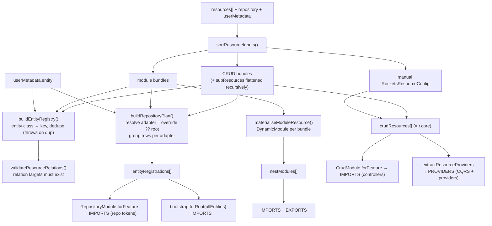
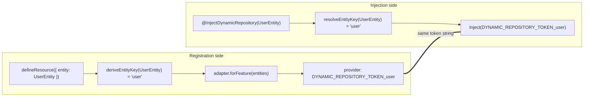
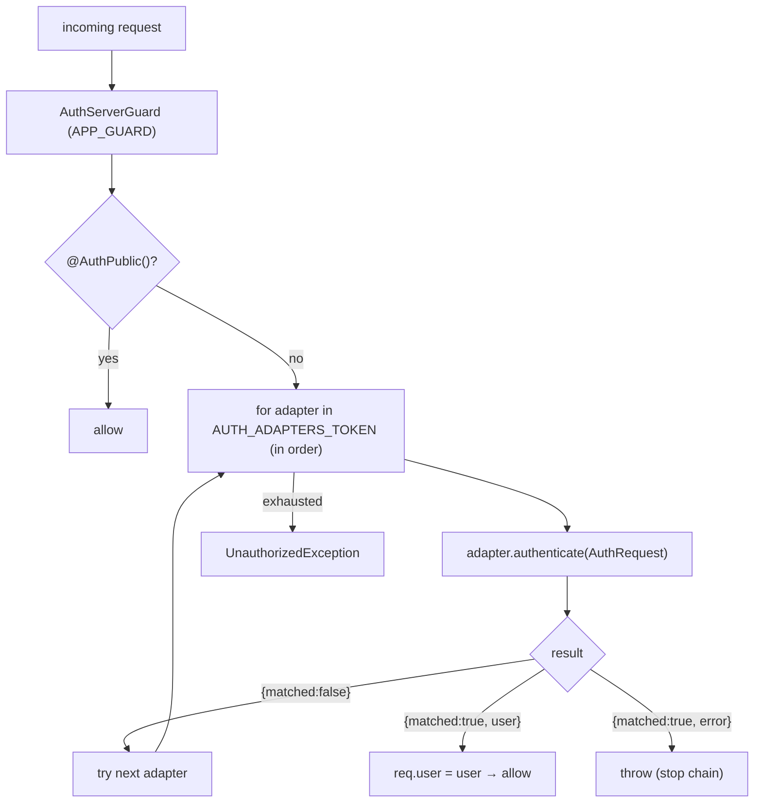
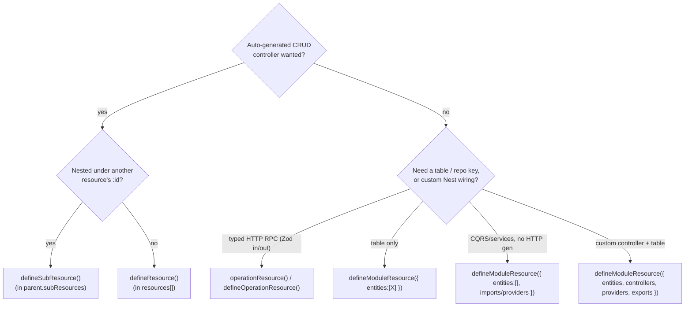

# Rockets — Configuration Entry Point

> Configuration reference for the **1.0-preview DSL**. Field names below match
> the current `packages/*/src/**` (code wins over prose). The original DSL
> rationale, convertibility proof, and change-set live in §12.
> Diagrams are Mermaid — they render on GitHub and in most Markdown viewers.

---

## 0. Mental model (read this first)

You never hand NestJS a tree of modules. You write **declarative bundles**
(`defineResource`, `defineSubResource`, `defineModuleResource`,
`operationResource` / `defineOperationResource`) and a few
top-level fields (`repository`, `userMetadata`, `auth`), pass them to
`createServer({...})`, and the module-definition transform converts that into a
single global `DynamicModule` (controllers, providers, repository tokens, CQRS
handlers, Swagger). Use `RocketsModule.forRoot({...})` directly when a larger
Nest host module must compose Rockets with other imports or providers.

```mermaid
flowchart LR
  subgraph YOU["What you write"]
    R["defineResource()"]
    S["defineSubResource()"]
    M["defineModuleResource()"]
    O["operationResource() / defineOperationResource()"]
    OPT["repository / userMetadata / auth / swagger"]
  end
  YOU --> CREATE["createServer( ... )"]
  CREATE --> FORROOT["RocketsModule.forRoot( ... )"]
  FORROOT --> XFORM["definitionTransform\n(build time)"]
  XFORM --> PLAN["buildAppRegistrationPlan()"]
  PLAN --> DM["one global DynamicModule\nimports / providers / controllers / exports"]
  DM --> APP["Nest App"]
```



**Two layers, one surface.** `@concepta/rockets` (server) is a thin presentation
layer over `@concepta/rockets-core`. Server adds the `MeController`, the global
guard opt-in, and the `auth` chain; core does the actual resource→module
conversion. `createServer` is the canonical definition-first facade;
`RocketsModule.forRoot` is the lower-level composition surface. Core's
`forRootAsync` is called internally in either case.

---

## 1. The entry point — `createServer` and `RocketsModule`

The options object is split by NestJS's `ConfigurableModuleBuilder` into two
buckets with very different lifecycles:

| Bucket | When consumed | Can be async? | Examples |
|---|---|---|---|
| **runtime options** | at runtime via `RAW_OPTIONS_TOKEN` | yes (`forRootAsync` factory) | `settings`, `swagger` |
| **extras** | at **build time** inside `definitionTransform` | **no** — always static | `resources`, `repository`, `userMetadata`, `auth`, guard flags |

> Consequence: `forRoot` vs `forRootAsync` only changes how `settings`/`swagger`
> resolve. **`resources` / `repository` / `userMetadata` / `auth` are identical
> on both** — they are structural, not async-resolvable.

### 1.1 Full option shape (server — `RocketsModule.forRoot`)

| Field | Type | Req? | Default | Purpose |
|---|---|---|---|---|
| `resources` | `ReadonlyArray<ResourceInput>` | optional | `[]` | The feature bundles (CRUD + module + sub flattened). |
| `repository` | `RepositoryModuleInterface \| RepositoryBootstrap` | optional† | — | Root persistence adapter (TypeORM/Firestore/…). |
| `userMetadata` | `RocketsUserMetadataConfig` | optional | — | `/me` entity + DTOs. When omitted, Rockets does not mount `/me` or register metadata handlers/providers. |
| `auth` | `AuthBootstrap \| AuthBootstrap[]` | optional | `[]` | Auth chain (external adapter and/or built-in). |
| `swagger` | `SwaggerUiOptionsInterface` | optional | — | Doc builder + UI. The **only** runtime field forwarded to core. |
| `settings` | `RocketsSettingsInterface` (empty today) | optional | — | Reserved; no fields yet. |
| `handlers` | `{ upsertUserMetadata?, getUserMetadata? }` | optional | built-ins | Override the user-metadata CQRS handlers. |
| `enableGlobalGuard` | `boolean` | optional | **on‡** | Register `AuthServerGuard` as `APP_GUARD` unless `=== false`. |
| `disableController` | `{ me?: boolean }` | optional | `{}` | Disable built-in `MeController`. |
| `controllers` | `DynamicModule['controllers']` | optional | — | Replace the auto controller set. |
| `global` | `boolean` | optional | **forced `true`** | `forRoot` always makes the module global. |

† `repository` is optional in the type but persistence resolution throws if an
entity has neither a per-entity override nor a root adapter.

‡ The built-in `defineRocketsAuth()` integration contributes `false` because
its upstream authentication module already owns a JWT global guard. Explicit
server options always win; mixed-auth hosts can opt the Rockets chain back in.

`*-server` / `*-core` split — what server forwards vs keeps:


**Server-only** (never reach core): `enableGlobalGuard`, `disableController`,
`controllers`, `settings`. These drive presentation: the `MeController` and the
`APP_GUARD` opt-in.

---

## 2. What you pass → what it becomes (the conversion)

The single conversion site is `buildAppRegistrationPlan()`, then
`definitionTransform` fans the plan into the module sections.

### 2.1 Plan shape

```ts
buildAppRegistrationPlan({ resources, repository?, userMetadata? }): AppRegistrationPlan

interface AppRegistrationPlan {
  crudResources:       RocketsResourceConfig[];       // → CrudModule.forFeature (controllers)
  entityRegistrations: RepositoryPersistenceConfig[]; // → RepositoryModule.forFeature (repo tokens), grouped per adapter
  nestModules:         DynamicModule[];               // → module-resource slices
}
```

> The plan carries **no hand-written controllers and no CQRS list** by default.
> Controllers come from CRUD materialisation and from `operationResource`
> generated adapters. CQRS handlers come from imported
> `CrudModule.forFeature` / module slices and are re-extracted later from
> `crudResources[].crud.operations[].queryHandler/commandHandler`.

### 2.2 Pipeline



Where artifacts land in the final `DynamicModule`:

| Artifact | Section | Via |
|---|---|---|
| CRUD controllers | `imports` | `CrudModule.forFeature(resource)` (one per CRUD resource) |
| Module-resource controllers | `imports` | inside each materialised slice |
| Core's own `controllers` | always `[]` | core emits none directly |
| CQRS handlers + resource `providers` | `providers` | `extractResourceProviders()` (deduped) |
| Entities → repo tokens | `imports` | `RepositoryModule.forFeature(group)` per adapter |
| Swagger | `imports` | one `SwaggerUiModule.registerAsync` |
| Re-exports | `exports` | tokens, `AuthServerGuard`, resource providers, module slices |

---

## 3. The dynamic-repository token contract (the key idea)

There is **no shared `*_ENTITY_KEY` constant** between registration and
injection. Both sides independently derive the same string key from the entity
class, so the tokens match.



- `deriveEntityKey`: strip trailing `Entity`, lowercase first char.
  `UserEntity → 'user'`, `PetTagEntity → 'petTag'`, `Order → 'order'`.
- `getDynamicRepositoryToken(key) → \`DYNAMIC_REPOSITORY_TOKEN_${key}\``.
- The concrete repository **provider is 100% adapter-owned** — core only
  forwards `{ module, entities }` groups; the adapter's `forFeature` builds the
  providers. Core never builds repository providers itself.
- String form (`@InjectDynamicRepository('billing/invoice')`) is the escape
  hatch for namespaced keys.

> **Branch note.** `InjectDynamicRepository` and `RepositoryModuleInterface` are
> provided by `@concepta/rockets-repository`, which this branch treats as the
> active repository abstraction (`rockets-core` re-exports them so features
> import from core). No decorator-to-core migration is pending. The dynamic
> token contract above is unchanged: registration and injection both resolve the
> same entity key and token string.

---

## 4. `defineResource()` — top-level CRUD

**Only `entity` is required.** Everything else is derived or defaulted.

### Minimum

```ts
export const petResource = defineResource({
  entity: PetEntity,
  // key   → 'pet'                  (deriveEntityKey)
  // path  → 'pets'                 (pluralized kebab of key)
  // tags  → ['Pets']
  // operations → [List, Read, Create, Update, Delete]
  // DTOs default to the entity shape
});
```

### Complete (adapted from `examples/sample-server/src/resources/pet/pet.resource.ts`)

```ts
export const petResource = defineResource({
  entity: PetEntity,
  relations: (relation) => [
    relation(PetVaccinationEntity, 'vaccinations'),
    relation(PetTagEntity, 'petTags'),
  ],
  hooks: [PetOwnerStamp, PetOwnerOrSharedHook, PetUniqueRefHook, PetAuditLogHook],
  operations: {
    list:   { output: PetResponseDto },
    read:   { output: PetResponseDto },
    create: { input: PetCreateDto, output: PetResponseDto },
    update: { input: PetUpdateDto, output: PetResponseDto },
    delete: { soft: true, returnDeleted: true },
    restore:{ returnRestored: true },
  },
  // repository: firestoreRepo,   // optional per-resource adapter override
  subResources: {
    petTags: defineSubResource({ /* see §5 */ }),
  },
});
```

### Field reference (grouped)

| Group | Field | Type | Default |
|---|---|---|---|
| **Identity** | `entity` **(req)** | `Type<E>` | — |
| | `key` | `string` | `deriveEntityKey(entity)` |
| | `path` | `string \| string[]` | pluralized kebab of key |
| | `tags` | `string[]` | `[humanize(key)]` |
| **DTOs** | `dto` | `{ response?, paginated?, create?, update?, replace? }` | `{}` (resource-level fallback; prefer per-op `input`/`output`) |
| **Operations** | `operations` | `OperationName[] \| OperationsObject` | `[List, Read, Create, Update, Delete]` |
| | `operations.X` | `{ input?, output?, paginated?, handler?, hooks?, decorators?, path?, transactional?, requestOverride?, responseOverride? }` (`input`→`request.body`, `output`→`response.resource`) | — |
| | `operations.delete` | `+ { soft?, returnDeleted? }` | `soft=false` |
| | `operations.restore` | `+ { returnRestored? }` — only valid with `delete.soft` | — |
| **Relations** | `relations` | array or `(rel) => entries[]` | — |
| **Persistence** | `repository` | `RepositoryModuleInterface` | root `repository` adapter |
| **Hooks** | `hooks` | `RocketsEntityHookForResource<E>[]` | — (auto-registered) |
| **Handlers** | `handlers` | `{ list?, read?, create?, … }` of `Type` | — (auto-registered) |
| | `autoRegisterHandlers` | `boolean` | `true` |
| | `providers` | `Provider[]` — **extras only**, not handlers/hooks | `[]` |
| **AuthZ / Swagger** | `public` | `boolean` | `false` (removes `@ApiBearerAuth`; still passes the global guard) |
| | `decorators` | `ClassDecorator[]` | — |
| | `request` | `CrudRequestConfig` | `{ params: { id: uuid primary } }` |
| **Nesting** | `subResources` | `{ [K in relation prop of E]?: SubResource }` | — |

**Auto-extraction rule:** handlers declared in `operations.X.handler` / `handlers.X`
become `queryHandler` (List/Read) or `commandHandler` (writes) and are
auto-registered as providers (with `hooks`). **Do not also list them in
`providers`** — `providers` is for extra services only.

**Flat config (no `crud.crud`):** the returned `core` is
`RocketsResourceConfig = CrudModuleForFeatureOptionsInterface + { providers? }`,
i.e. exactly one `crud` level: `{ crud: { controller, operations }, providers }`.

---

## 5. `defineSubResource()` — nested under a parent

A sub-resource is **never** placed in `resources[]`. It is a value inside a
parent's `subResources` map, keyed by a **real relation property of the parent
entity** (typo → compile error). The parent materialises it into a peer CRUD
resource with a composed path and auto-injected `PathScopeGuard` + `PathScopeHook`.

```text
parent path  +  :<parentKey>  +  segment
   /pets      +     /:petId      +    /tags     →   /pets/:petId/tags
```

### Minimum (secure by default)

```ts
defineSubResource({ entity: PetTagEntity })
// owner defaults to 'userId', scope on, FK derived (pet+Id → :petId).
// → /pets/:petId/tags with FK filter + ownership guard, zero config.
```

### Complete (verbatim shape from `pet.resource.ts`)

```ts
petTags: defineSubResource({          // key 'petTags' must be a PetEntity relation prop
  entity: PetTagEntity,
  segment: 'tags',                    // → /pets/:petId/tags (default would be 'pet-tags')
  tags: ['Pet Tags'],
  owner: 'userId',                    // ownership column (default 'userId'; `false` = public)
  // scope: false,                    // would disable FK filter+stamp+guard entirely
  // parentKey: 'animalId',           // FK + URL param override (default <parent>Id)
  // parentPk: 'companyId',           // parent PK column for the guard (default 'id')
  reloadAfterCreate: true,            // opt-in AfterCreateReloadHook (eager relations on create)
  hooks: [PetTagTagIdExistsHook],
  relations: (relation) => [
    relation(() => PetEntity, 'pet'),
    relation(() => TagEntity, 'tag'),
  ],
  operations: {
    list:   { output: PetTagResponseDto },
    read:   { output: PetTagResponseDto },
    create: { input: PetTagCreateDto, output: PetTagResponseDto },
    delete: {},
  },
})
```

### Field reference (sub-specific; inherits all `defineResource` fields except `path`)

| Field | Type | Req? | Default |
|---|---|---|---|
| `entity` | `Type<E> \| (() => Type<E>)` | **yes** | — (thunk allowed for circular imports) |
| `parentKey` | `string` | no | `${parentEntityKey}Id` (e.g. `petId`) — URL param **and** FK column |
| `parentPk` | `string` | no | `'id'` — parent PK column the guard looks up |
| `parentSelect` | `readonly string[]` | no | projection for the guard's parent lookup (default: pk only, or the full row when the parent has hooks) |
| `segment` | `string` | no | `kebab-case(mapKey)` — URL segment |
| `owner` | `string \| false` | no | `'userId'` — ownership column; `false` drops the guard (public) |
| `scope` | `boolean` | no | `true` — master switch (FK filter/stamp + guard); `false` = unscoped |
| `reloadAfterCreate` | `boolean` | no | `false` |
| *(inherited)* | `dto`, `operations`, `relations`, `hooks`, `handlers`, `providers`, `subResources`… | no | — |

### Which parent-side hooks run during path scoping

`PathScopeGuard` performs one parent lookup per nested request, and that
lookup runs the **parent resource's own `hooks`** — the classes declared in
the parent's `defineResource({ hooks })`. A parent that its own routes
cannot see (soft expiry, retention, tenant scope expressed as a
`beforeFindOne` / `afterFindOne` filter) is a `404` on every nested route
too, not just on the parent's routes.

**What the replay context carries.** The lookup is presented to those
hooks as the parent's OWN read: `getCrudContext(ctx)` returns a context
with `entity` = the parent's key, `operation: Read`, and `params` = the
request's route params with `id` bound to the parent row being looked up.
A hook gated on `if (!getCrudContext(ctx)) return options;` — the shape
this codebase documents — therefore filters here exactly as it does on the
parent's own routes. That also makes three-level nesting behave: a
grandchild's guard replays the middle resource's `PathScopeHook`, which
needs `params[:parentId]` to bind the middle row to ITS parent.

The parent's primary param is bound by NAME, taken from the parent's own
`request.params` (default `id`) — a resource that declares a different
primary still sees its hooks fire.

**What it deliberately does not carry:**

- **No transaction.** Nest runs guards ahead of interceptors, so no
  operation transaction exists when the guard runs. The lookup is a
  pre-check, never a participant. See §12 and issue #60 for the wider
  `ctx` / `TransactionScope` seam.
- **No `query`.** The guard applies no filter, sort or pagination of its
  own, so the parsed query is empty rather than the child route's.
- **Not the request's `AppContextHost`.** `defineOverlay` is
  first-write-wins and the hook overlay interceptor has not run yet;
  writing to the request here would pin the parent's hooks for the whole
  request and the child's own hooks would never attach.

Other constraints worth knowing:

- The parent's hooks are entity-scoped by `@EntityHook({ entity })`, so
  hooks bound to a different entity never fire on this lookup.
- **A parent hook that throws now surfaces on nested routes.** It did not
  fire here before. A `Before*` hook that throws an `HttpException` is
  wrapped by the upstream membrane and reaches the client as a `500` —
  throw a `RepositoryQueryException` with an `httpStatus` instead when the
  status matters.
- **Projection cost.** With no parent hooks the lookup reads the primary
  key only. With hooks it reads the FULL parent row — including eager
  relations — because an `afterFindOne` hook may inspect a column a
  narrow projection would omit, and nothing declares which columns a hook
  reads. Set `parentSelect: ['id', 'expiresAt']` on the sub-resource when
  you know what your hooks need.
- **`owner: false` drops the guard entirely**, and with it the parent-hook
  replay. A sub-resource that opts out of the ownership check also opts
  out of parent-side visibility.
- Sub-resource hooks (`PathScopeHook`, the child's own `hooks`) are
  unaffected — they still attach normally to the child's controller.

---

## 6a. `operationResource()` — typed non-CRUD endpoints (issue #43 / #50)

Use when you need **RPC-style** routes beside CRUD — health checks, actions,
reports — without hand-rolling a Nest controller. Zod `input` / `output`
compile to DTO classes (OpenAPI + Standard Schema whitelist). Wire the bundle
into `resources[]` like any other resource.

```ts
import { operationResource } from '@concepta/rockets-core/zod';
import { z } from 'zod';

export const ops = operationResource({
  path: 'ops',
  tags: ['Ops'],
  public: true, // class-level @AuthPublic; individual ops cannot be more private
  operations: (op) => ({
    ping: op.read({
      path: '', // root mount → GET /ops (default path is the operation key)
      output: z.object({ ok: z.boolean() }),
      handler: () => ({ ok: true }),
    }),
    shout: op.write({
      status: 201, // default is 200
      input: z.object({ text: z.string().min(1) }),
      output: z.object({ text: z.string() }),
      handler: ({ input }) => ({ text: input.text.toUpperCase() }),
    }),
    list: op.read({
      path: 'items', // GET /ops/items (or rename the key to `items` and omit path)
      output: z.array(z.object({ id: z.string() })),
      handler: () => [{ id: '1' }],
    }),
    // output: false opts out of response whitelist (explicit)
    purge: op.delete({
      status: 204,
      output: false,
      handler: () => undefined,
    }),
  }),
});

// Path params: resource `params` must list every :name on `path`.
// Nested op segments (e.g. key `transfer` → /pets/:petId/transfer) stay in ctx.params.
export const petTransfer = operationResource({
  path: 'pets/:petId',
  params: z.object({ petId: z.uuid() }),
  operations: (op) => ({
    transfer: op.write({
      input: z.object({ newOwnerId: z.uuid() }),
      output: z.object({ id: z.string(), userId: z.string() }),
      handler: TransferHttpHandler, // injectable class with handle(ctx)
    }),
  }),
});
```

| Builder | Allowed methods | Default method | Default status |
|---|---|---|---|
| `op.read()` | `GET` | `GET` | `200` |
| `op.write()` | `POST` / `PUT` / `PATCH` | `POST` | `200` (set `status: 201` when creating) |
| `op.delete()` | `DELETE` | `DELETE` | `200` |

**Authoring rules (#50).** `operations` is a **callback** so base-path
`:params` type `ctx.params`. Operation path defaults to the **key verbatim**
(not kebab-cased); use `path: ''` for a root-mounted route. Input sourcing
follows HTTP method (`GET`/`DELETE` → query; body otherwise). **`output` is
required** — pass a schema (whitelist + OpenAPI) or `output: false` (explicit
opt-out). Optional resource-level `params: z.object({...})` validates named path
params at request time (400). Keys must be `:params` on the resource `path`;
extra Nest params from an operation path (not in the schema) are preserved.
Structured cross-resource route collisions with CRUD/Sub fail in
`buildAppRegistrationPlan` (not silently at runtime). This planner check is
limited to Rockets-owned resource declarations; use
`validateRegisteredRoutes(app)` after `app.init()` when you need to audit the
actual Nest adapter routes with global prefix, versioning, and hand-written
controllers applied. Status `204` with an output schema is rejected at define
time. The return value exposes `authored` (typed pending ops) for inference
consumers; function handlers get full `ctx` typing — injectable class `handle`
methods do not (TypeScript method bivariance).
Class handlers can be passed as `handler: TransferHttpHandler` or explicitly as
`handler: { useClass: TransferHttpHandler }`; a matching local provider in
`providers` wins over auto-registration.

**Auth / ACL.** Resource `public: true` opens the whole controller. On a secured
resource, mark individual ops with `public: true`. Setting `public: false` on
an op under a public resource is rejected at boot. **v1 does not wire ACL
grants** — authenticated routes are open to any authenticated user unless you
pass method `decorators` (e.g. access-control grants). Omitting `input` means
the raw body/query reaches the handler unvalidated.

**Validation.** Responses are whitelisted against `output` when present;
handler/`output` mismatches return **500** (server bug), not 400. Query-string
inputs are strings — use `z.coerce.number()` / `z.coerce.boolean()` when needed.
`output` accepts `z.object(...)` or `z.array(...)`. Duplicate `method`+`path`
pairs inside one resource fail at boot.

Cursor, SSE, binary, raw JSON, idempotency, and external-client scaffolds are
follow-ups on issue #43.

Lower-level escape hatch: `defineOperationResource({ path, operations: {…} })`
with precompiled DTO classes.

---

## 5a. `acl` — access control on resources and operations (issue #51)

Upstream's check-access handler returns `true` for any route with **no
grant metadata**. A forgotten `AccessControl*` decorator is therefore not
a broken route — it is an *open* one, authenticated but ungranted, and no
test notices. `acl` moves that from a per-route chore to a bundle-level
declaration the framework materialises and validates.

Rules stay app-owned. This wires decorators and registers query services;
it does not generate `acRules`, and possession (`own` vs `any`) is still
decided by your `CanAccess` service.

```ts
defineResource({
  entity: PetEntity,
  path: 'pets',
  acl: { resource: 'pet', query: PetAccessQueryService },
  operations: {
    list: {},                 // → read
    read: {},                 // → read
    create: {},               // → create
    update: {},               // → update
    delete: {},               // → delete
    // restore: { acl: false } // authenticated, deliberately ungranted
  },
});
```

Action per operation: `list`/`read` → **read**, `create` → **create**,
`update`/`replace` → **update**, `delete`/`restore` → **delete**.
(`AccessControlReadMany` and `AccessControlReadOne` emit the same grant
upstream, so there is one action per verb, not one per decorator.)

### `operationResource`

A non-CRUD write's HTTP verb says nothing about intent —
`POST /pets/:id/transfer` is an update, not a create — so `op.write` has
**no default** and must declare one:

```ts
operationResource({
  path: 'pets/:petId',
  acl: { resource: 'pet', query: PetAccessQueryService },
  operations: (op) => ({
    transfer: op.write({ acl: 'update', input: …, output: …, handler: … }),
    stats:    op.read({ /* infers read */ output: …, handler: … }),
  }),
});
```

### Boot-time rules

| Condition | Result |
|---|---|
| Bundle declares `acl`, app configures no root `accessControl` | **throw** |
| `operations.X.acl` action with no resource-level `acl` | **throw** |
| `op.write` with no `acl` on an ACL-enabled operation resource | **throw** |
| `public: true` on an operation that also carries a grant | **throw** |
| `accessControl.enforceGrants: true` and a **generated** authenticated op carries no grant | **throw** |
| `accessControl.enforceGrants: true` with no root `accessControl` | **throw** |

`acl.query` services are collected across every bundle and merged into
`AccessControlModule.forRoot({ queryServices })` — they must land on that
module specifically, because the upstream guard strict-resolves from its
own host module. You no longer declare a query service and then 500 at
request time because nobody registered it.

### One `CanAccess` per route, and why `query` really overrides

The service is stamped on the **route**, never on the controller: the
operation's own `query` when it declares one, otherwise the
resource-level default.

That is not a style choice. Upstream reads query metadata with
`getAllAndMerge([getClass(), getHandler()])` and then loops the resulting
services, **breaking on the first one that returns `true`** — class-level
first. A class-level default plus a method-level "override" is therefore
an OR in which the *permissive* service wins, and an operation could
never tighten. Stamping exactly one entry per route is what makes
`acl: { action, query }` mean what it says.

A consequence worth knowing: a resource-level `query` is consulted on
**every** route of the resource, including collection routes that have no
row to own. Return early there (`if (!params.id) return true`).

### Sub-resources do not inherit `acl`

A sub-resource is a different resource in your `acRules`. It declares its
own `acl: { resource: 'widget-note' }`; nothing is taken from the parent's
`acl.resource`. If it declares none, it has no grants — and shows up in
the `enforceGrants` report under its own key.

### `enforceGrants` — scope and why it is opt-in

With it on, a route the planner generates that is authenticated and
carries no grant fails the boot instead of serving.

**It covers exactly what the planner generates:** CRUD bundles (including
sub-resources, which are flattened recursively) and operation resources.
It does **not** cover:

- `defineModuleResource({ module: { controllers } })` controllers
- hand-built `RocketsResourceConfig` entries
- controllers owned by other packages — `MeController` in
  `rockets-server`, every `rockets-server-auth` controller

Those routes never reach the planner, so a passing boot says nothing
about them. Treat `enforceGrants` as "the generated surface is covered",
not "the app is covered".

It defaults to **off** because a hand-written `AccessControl*` entry in a
bundle's `decorators` cannot be detected **at plan time**: the CRUD
controller is built downstream of the planner, so the grant metadata does
not exist yet, and the only way to read it early would be to apply the
consumer's opaque decorator list a second time. Turning the default on
would reject every working manual-grant app. A bootstrap-time sweep over
discovered routes would close both this and the scope gap above.

For the same reason, `acl` plus a manual `AccessControl*` decorator on the
same operation is **not** detected and rejected — they are documented as
mutually exclusive. Upstream's grant metadata is a `SetMetadata` write, so
combining them means one silently wins. Use one or the other per bundle.

### `public` and `acl` do not mix

A public route carries no authenticated user, so role resolution yields
nothing and every grant check fails — the route would 403 for everyone.
Declaring both on the same operation throws at definition time. Opt the
operation out with `acl: false` if a public resource needs one ungranted
route.

### `rockets-server-auth` registers its own `AccessControlModule`

`defineRocketsAuth` wires access control through its own
`buildAccessControlImport` call, which does not receive the collected
query services. In an app composing auth **and** `RocketsCoreModule` with
`accessControl` on both, `acl.query` auto-registration applies to the
core registration only — list auth-side services in that module's
`queryServices` explicitly.

---

## 6. `defineModuleResource()` — persistence rows + custom Nest slice

Use when you need entity keys and/or **hand-written** controllers/services/CQRS
(not an auto-generated CRUD controller). It contributes two things at once:
optional dynamic-repository rows (same plan as `defineResource`) **and** an
inline `DynamicModule` (so no extra `XModule` in `AppModule.imports`).

### Minimum (entity row only)

```ts
export const sampleAuthUserResource = defineModuleResource({
  entities: [UserEntity],            // class shorthand → key 'user'
});
```

### CQRS-only (`entities: []`) — no new table; hand-written Nest slice

Use this when you need CQRS handlers / services **without** a generated HTTP
surface. For typed HTTP actions over CQRS (no hand-written controller), prefer
[`operationResource`](#6a-operationresource--typed-non-crud-endpoints-issue-43--50)
instead — see `examples/sample-server` `petTransferFeature`.

```ts
export const orderWorkflowFeature = defineModuleResource({
  imports: [CqrsModule],
  providers: [PlaceOrderHandler, OrderPlacedListener],
});
```

### Complete (entity + controller + service + exports)

```ts
export const githubFeature = defineModuleResource({
  entities: [GithubConnectionEntity],
  controllers: [GithubController],
  providers: [GithubConfig, GithubOAuthStateService, githubApiClientProvider(), GithubService],
  exports: [GithubService, GITHUB_API_CLIENT],   // public surface — see ⚠ below
});
```

### Field reference

| Field | Type | Notes |
|---|---|---|
| `entities` | `Array<Type \| { key?, entity, repository?, collection? }>` | defaults `[]`; bare class derives key; **per-entity `repository` override** = the way to put one table on a different adapter |
| `imports` | `DynamicModule['imports']` | e.g. `CqrsModule`, `OtpModule.forFeature(...)` |
| `controllers` | `DynamicModule['controllers']` | hand-written controllers |
| `providers` | `Provider[]` | services, hooks, guards, CQRS handlers, token literals |
| `exports` | `DynamicModule['exports']` | **globally injectable** — see rule |

### ⚠ Public-surface export rule

Because core is `global: true` and re-exports every module slice, **everything
in `exports[]` is injectable app-wide** — including the `inject:[...]` of an
outer `forRootAsync` factory. The collision risk is by **injection token**: two
bundles exporting the **same token** (the same class reference, or the same
string/symbol token) shadow each other (last one wins). Rule:

- crosses a feature boundary → `providers` **and** `exports`
- internal only → `providers` only
- collision risk → prefix the class (`BillingPriceFormatter`) or use an explicit
  injection token/symbol for shared cross-feature providers

> Note: `CLAUDE.md` rule 14 phrases this as "same class **name**". Nest keys
> providers by token (class reference), so two *distinct* classes that merely
> share a name are *different* tokens and don't actually collide — but they're a
> readability/foot-gun hazard. Reconcile the rule-14 wording with whoever owns
> `CLAUDE.md`.

Canonical minimum-surface example: the sample auth wiring exports **only**
`SampleAuthAdapter`; `AuthController` and `UserEntity` stay internal.

---

## 7. Auth — two modes

Both modes produce an `AuthBootstrap` passed to `forRoot({ auth })`. `auth`
accepts one bootstrap or a **chain** (array, tried in order).

```ts
interface AuthBootstrap<A extends AuthAdapterInterface = AuthAdapterInterface> {
  adapter: Type<A>;
  forRoot?: () => DynamicModule;   // host module: provides+exports the adapter
  identity?: {                    // singular user-space ownership
    resources?: ReadonlyArray<ResourceInput>;
    userMetadata?: RocketsUserMetadataConfig;
    repository?: RepositoryModuleInterface | RepositoryBootstrap;
  };
  contributes?: {                 // integration-owned guard defaults
    enableGlobalGuard?: boolean;
    providesAppGuard?: boolean;
  };
}
```

At most one bootstrap may claim `identity`; two owners fail at composition even
when explicit server values are supplied. Explicit server values override the
single owner's values, and its resources are prepended to application
resources. Guard contributions may coexist, but conflicting values or competing
global guards fail fast instead of depending on import order.



`AuthAdapterInterface` is a single method:

```ts
interface AuthRequest { headers; query; raw; }          // raw = escape hatch
type AuthAttemptResult =
  | { matched: false }                                   // not mine → next adapter
  | { matched: true; user: AuthorizedUser }              // ok → stamp req.user, stop
  | { matched: true; error: HttpException };             // mine but rejected → throw, stop

interface AuthAdapterInterface {
  authenticate(request: AuthRequest): Promise<AuthAttemptResult>;
}
```

**Global guard (default-on / opt-out):** `AuthServerGuard` is registered as
`APP_GUARD` **unless `enableGlobalGuard === false`**. Auth integrations may
contribute a different default; explicit app configuration wins. Routes are
guarded unless explicitly made public (`@AuthPublic()`) or the global guard is
disabled.

### 7a. External auth (`@concepta/rockets`) — you own `authenticate()`

Minimum:

```ts
const auth = defineAuthAdapter(MyAuthAdapter);
```

Complete (`examples/sample-server/src/auth/define-sample-auth.ts`):

```ts
export function defineSampleAuth(): AuthBootstrap<SampleAuthAdapter> {
  return defineAuthAdapter(SampleAuthAdapter, {
    controllers: [AuthController], // controller stays integration-private
  });
}

RocketsModule.forRoot({
  auth: defineSampleAuth(),
  userMetadata: { entity: UserMetadataEntity, createDto: UserMetadataCreateDto, updateDto: UserMetadataUpdateDto },
  repository: defineTypeOrmRepository({ type: 'sqlite', database: ':memory:', synchronize: true }),
  resources: [ sampleAuthUserResource, petResource, /* … */ ],
});
```

### 7b. Built-in auth (`@concepta/rockets-auth`) — `defineRocketsAuth`

Full JWT / signup / login / recovery / OTP / admin / invitation system. Returns
an `AuthBootstrap` (adapter defaults to `RocketsJwtAuthAdapter`).

> **The option shape is NOT `{ jwt, signup, login, … }`.** It is
> `DefineRocketsAuthInput = RocketsAuthAsyncOptions &`
> `{ persistence, userMetadata, userCrud, … }`.
> The wire-protocol config lives under a nested `authentication` block.

```ts
type DefineRocketsAuthInput = RocketsAuthAsyncOptions & {
  persistence: { module: RepositoryModuleInterface; entities: { user, userCredentials, userOtp, role, userRole, federatedIdentity } };
  userMetadata: RocketsUserMetadataConfig;
  userCrud: { model; dto: { createOne; updateOne } };   // signup/admin CRUD
  invitationEntity?: Type;
  rocketsDefaults?: { enableGlobalGuard?: boolean };
  authAdapter?: Type<AuthAdapterInterface>;
};
```

Concept → field map:

| You want | Lives under |
|---|---|
| JWT secrets/signing | `authentication.settings.jwt.{access,refresh}` |
| login/strategies | `authentication.settings.strategies` |
| recovery | `/recovery/*` controllers (enabled by default) + required `authentication.ports.recoveryNotification`; verification uses `verifyNotification` |
| otp | `otp` block + `settings.otp` + `disableController.otp` |
| signup / admin | `userCrud` (+ `handlers.*`) + `disableController.{signup,admin}` |
| oauth / federated | `federated` persistence block; OAuth provider routes are deferred from the current 1.0 scope |

Complete (`examples/sample-server-auth/src/app.module.ts`):

```ts
const repo = defineTypeOrmRepository({ type: 'sqlite', database: ':memory:', synchronize: true, dropSchema: true });

const rocketsAuthInput: DefineRocketsAuthInput = {
  persistence: { module: repo, entities: { user: UserEntity, userCredentials: UserCredentialEntity,
                 userOtp: UserOtpEntity, role: RoleEntity, userRole: UserRoleEntity, federatedIdentity: FederatedEntity } },
  invitationEntity: InvitationEntity,
  userMetadata: { entity: UserMetadataEntity, createDto: UserMetadataCreateDto, updateDto: UserMetadataUpdateDto },
  useFactory: () => ({
    services: { mailerService: buildSampleMailerService() },          // mailerService REQUIRED
    authentication: { ports: rocketsAuthNotificationPorts },          // recovery + verify ports
    settings: rocketsAuthRuntimeSettings,                             // role names, templates, otp
  }),
  userCrud: { model: UserDto, dto: { createOne: UserCreateDto, updateOne: SampleUserUpdateDto } },
  roleCrud: { model: RoleDto, dto: { createOne: RoleCreateDto, updateOne: RoleUpdateDto } },
};

const rocketsAuth = defineRocketsAuth(rocketsAuthInput);

RocketsModule.forRoot({
  auth: rocketsAuth,
  resources: [createPetResource(), /* … */],
});
```

`defineRocketsAuth` contributes its persistence resources, metadata contract,
repository bootstrap, and guard preference to the surrounding server. The host
only declares application-owned resources. Explicit server options remain the
escape hatch and take precedence over those contributed defaults. Its Rockets
guard preference is `false` because `AuthenticationModule` already owns the JWT
global guard; mixed-auth hosts can set `rocketsDefaults.enableGlobalGuard: true`
to make the ordered Rockets adapter chain the owner. In that mode, an
unspecified upstream `auth.appGuard` is normalized to `false`; an explicit
competing app guard is rejected because Nest global guards are cumulative.

Auth throttling uses Express's resolved `request.ip`. A host behind a reverse
proxy must configure `app.set('trust proxy', ...)` for its actual topology.
Rockets intentionally does not trust forwarded headers on the host's behalf.
Without that setting, clients can collapse into the proxy's single IP bucket;
an overly broad setting lets callers spoof addresses and evade the limit.

---

## 8. Repository (root adapter) — database-agnostic

The `repository` field is the default persistence adapter. Core only knows two
contracts; the concrete backend is selected in your factory and is swappable.

```ts
interface RepositoryModuleInterface {                    // upstream minimal contract
  name: string;
  forFeature(entities: RepositoryProviderOptions[]): DynamicRepositoryModule;
}
interface RepositoryBootstrap extends RepositoryModuleInterface {
  forRoot(entities: ReadonlyArray<Type>): DynamicModule; // creates the root connection
}
```

Minimum:

```ts
repository: defineTypeOrmRepository({ type: 'sqlite', database: ':memory:', synchronize: true })
```

Selecting TypeORM:

```ts
import { defineTypeOrmRepository } from '@concepta/rockets-repository-typeorm';

const repository = defineTypeOrmRepository({
  type: 'sqlite',
  database: ':memory:',
  synchronize: true,
});
```

Swap to Firestore = pass a `defineFirestoreRepository(...)` instead — **no
core/server change**. Per-entry repository overrides can be declared on any of:

- `defineResource({ repository })` — override for that one CRUD resource's entity
- `defineModuleResource({ entities: [{ entity, repository }] })` — per entity row
- `userMetadata.repository` — override for the metadata table

Each falls back to the root `repository` adapter when omitted.

### 8a. `ctx` and transactions — the seam you must not miss (issue #60)

Every `RepositoryInterface` method takes an options `ctx`. It is optional
in the type system and load-bearing at runtime. **A repository call that
omits it silently does two things you almost never intend:**

1. it runs with **all entity hooks disabled**, and
2. it commits **outside** the surrounding operation's transaction.

Neither is a type error. Neither shows up in a passing test. This is the
root of issue #45, where a guard's parent lookup ran hook-free for a
whole development cycle behind a green suite.

The chain, in the installed packages:

```text
RepositoryAdapter.entityCtx(ctx)      // returns undefined when ctx is undefined
  → HookResolverService.execute(...)  // early-returns when ctx.hooks is empty
  → TransactionManager                // never consulted, so no ambient transaction
```

#### Rule: forward `ctx` from wherever you got it

Inside a hook, the context is the hook's second argument:

```ts
const AuditHook = defineHook<OrderEntity>(OrderEntity, {
  async beforeCreate(payload, ctx, { repo }) {
    // `ctx` — not omitted. Without it this read skips every hook on
    // `order` AND runs outside the operation's transaction, so a
    // rollback leaves it committed.
    const existing = await repo.findOne({
      where: Where.eq<OrderEntity>('ref', payload.ref),
      ctx,
    });
    if (existing) throw new ConflictException('duplicate ref');
    return payload;
  },
});
```

Inside a CQRS handler or a service reached from a controller, take the
CRUD context the pipeline already built:

```ts
@QueryHandler(MyQuery)
export class MyHandler {
  constructor(
    @InjectDynamicRepository('order')
    private readonly orders: RepositoryInterface<OrderEntity>,
  ) {}

  async execute(query: MyQuery) {
    return this.orders.find({ where: …, ctx: query.crudContext });
  }
}
```

#### CRUD `transactional: true` vs manual `TransactionScope`

`transactional: true` exists on **CRUD operations only**
(`operations.X.transactional`) and on `operationResource` operations. It
wraps the handler in `TransactionScope.run` with `SUPPORTS` propagation.
Everything else — a custom service, a guard, a background job — has to
open its own scope:

```ts
import { TransactionScope } from '@concepta/nestjs-repository';

@Injectable()
export class TransferService {
  constructor(
    private readonly trx: TransactionScope,
    @InjectDynamicRepository('account')
    private readonly accounts: RepositoryInterface<AccountEntity>,
  ) {}

  async transfer(ctx: unknown, from: string, to: string, amount: number) {
    // `REQUIRED` starts one if none is active; the default `SUPPORTS`
    // would silently run unprotected outside a request.
    return this.trx.run(
      ctx,
      async (txCtx) => {
        const debit = await this.accounts.findOne({ where: …, ctx: txCtx });
        // …every call inside gets `txCtx`, or it escapes the transaction.
        await this.accounts.update(debit, { balance: … }, { ctx: txCtx });
      },
      { propagation: 'REQUIRED' },
    );
  }
}
```

Two traps worth naming:

- **`SUPPORTS` is the default propagation.** A scope opened without
  `propagation: 'REQUIRED'` inside a non-transactional entry point runs
  with no transaction at all, and nothing warns.
- **Guards run before interceptors.** A guard cannot participate in the
  operation's transaction, because the transaction interceptor has not
  run yet. `PathScopeGuard` is deliberately a pre-check for this reason
  (§5).

#### Auditing an app for the omission

The sweep that found the real defect behind #45:

```bash
grep -rnE '\.(findOne|find|count|findAndCount|create|update|delete)\(\{' src \
  | grep -v 'ctx'
```

Every hit is a call to read: either it is deliberately outside the
request (a startup task, a job with its own scope) or it is a defect.

---

## 9. userMetadata

```ts
interface RocketsUserMetadataConfig {
  entity: Type;                       // dynamic-repo row (key 'userMetadata') + /me route
  createDto: Type;                    // must extend UserMetadataCreatableInterface
  updateDto: Type;                    // must extend UserMetadataModelUpdatableInterface
  responseDto?: Type;                 // optional /me response
  repository?: RepositoryModuleInterface; // per-entity adapter override
}
```

Enable the optional `/me` surface by supplying:

```ts
userMetadata: {
  entity: UserMetadataEntity,
  createDto: UserMetadataCreateDto,
  updateDto: UserMetadataUpdateDto,
}
```

---

## 10. Decision guide



| Need | Use |
|---|---|
| Standard CRUD HTTP surface (`/pets`) | `defineResource` |
| Child route keyed by a parent relation (`/pets/:petId/tags`) | `defineSubResource` |
| Typed non-CRUD HTTP (`POST /pets/:petId/transfer`, `/ops/shout`) | `operationResource` / `defineOperationResource` |
| Register an entity for `@InjectDynamicRepository` | `defineModuleResource({ entities:[X] })` |
| CQRS/workflow providers, no generated routes | `defineModuleResource({ entities:[] })` |
| Hand-written controller + services | `defineModuleResource({ controllers, providers })` |
| One table on a different DB | `defineModuleResource` entity row `{ entity, repository }` |

---

## 11. Open items (flagged from the code)

1. **Repository import source** — on this branch
   `@concepta/rockets-repository` is
   full self-contained source (no longer a thin `@concepta/nestjs-repository`
   wrapper). `RepositoryModuleInterface` / `InjectDynamicRepository` resolve from
   it directly; no decorator-to-core migration is pending here.
2. ✅ **Stale `defineResource` docstring fixed** (now "Required: `entity`; the
   rest derived"). Note: `authFeature` in the `defineModuleResource` docstring is
   still an *illustrative* name, not a real constant (the real sample is
   `sampleAuthUserResource` + `defineSampleAuth`).
3. ✅ **`SafeCrudContextInterceptor` removed** — upstream
   `CrudContextOverlay.attach()` no-ops on non-CRUD handlers
   (`@concepta/nestjs-crud` `5249672` / `8.0.0-alpha.8`).
4. **OAuth** — federated identity persistence exists, but provider-specific
   OAuth routes are deferred from the current 1.0 scope.
5. **`settings`** — both server and core `settings` are empty interfaces today
   (reserved slot).

---

> **Reading guide.** §1–§10 describe the **current shipped configuration
> surface** (the contract). §12 is **design rationale + change-set / history**.
> If the two ever conflict, the source code and §1–§10 are authoritative.

## 12. Signature v2 — design rationale & change-set (SHIPPED)

> **Status: implemented.** The DSL described in §1–§10 is live in
> `packages/rockets-core/src/**`, with all sample apps migrated. The root
> `release:check` gate verifies builds, spec typechecking, code and Markdown
> linting, unit and package E2E tests, sample builds/E2E tests, and dry-run
> package artifacts. This section keeps the *why* — the constraint, the
> convertibility proof, the locked naming, and the change-set.
>
> **Constraint:** "no breaking" meant **no functional / feature regression** —
> NOT "cannot change the entry config". The input DSL was ours to redesign; the
> hard rule was that every DSL field maps onto a real crud / repository
> capability (the conversion must work) and no capability is lost. The sample
> apps were migrated as the end-to-end proof.

### 12.1 Convertibility map (the proof — every field lands somewhere real)

Verified against source: crud
`CrudRequestConfig = { params, body, bodyBatch, validation }`
(`crud-request-config.interface.ts`), `CrudQueryOptionsInterface.join: JoinClause[]`,
repository `RepositoryProviderOptions = { key, entity, relations }`
(`repository-provider-options.interface.ts`), `JoinClause` + relation `through`
metadata (`join-clause.interface.ts`, `repository-relation-metadata.interface.ts`).

| DSL v2 (input) | → crud target | → repository target |
|---|---|---|
| `entity` | `@CrudController({ entity: key })` | `RepositoryProviderOptions.entity` |
| `key` (or derived) | controller `entity` string key | `.key` → `DYNAMIC_REPOSITORY_TOKEN_<key>` |
| `path` | `@CrudController({ path })` | — |
| `tags` | `@ApiTags` | — |
| `repository` | — | `RepositoryModuleInterface.forFeature` (root or per-resource) |
| `operations.create.input` | `@CrudCreate({ request: { body } })` | — |
| `operations.read.output` | `response: { resource }` | — |
| `operations.list.paginated` | `response: { paginated }` | — |
| `operations.X.handler` | `commandHandler` / `queryHandler` | — |
| `operations.delete.soft` | `@CrudSoftDelete` vs `@CrudDelete` | `@DeleteDateColumn` (adapter) |
| `relations` (`federated`, `distinctFilter`) | `CrudJoin` / `join: JoinClause[]` | `relations: Record<name, RelationActionConfig>` |
| sub-resource link (direct FK) | `request.params` + `PathScopeHook` (where + stamp) | `WhereCondition` on FK column |

**M:N note:** the repository models junctions
(`through: { relation, fromKey, toKey }`)
and `WhereCondition.relation` lets a filter cross a join — so M:N is supported for
**reads** (list/read through the junction). A **writable** sub-resource stays a
direct 1:N FK (you stamp one column on create), which is why a junction is exposed
as its own entity (e.g. `PetTag`), not as `Tag` directly. No change needed — just
do not present join as the parent-child association mechanism.

### 12.2 Naming decisions (locked)

- **Per-operation DTOs: `input` / `output`.** Not `body` (write-only word) and not
  `request` — `request` is already the `{ params, body, bodyBatch, validation }`
  envelope in crud, so it is taken. `input → request.body`, `output → response.resource`.
- **`repository` at the application/resource layer.** Single name for "which
  adapter": root, per-resource, per-entity, and `userMetadata`. Built-in auth
  retains `persistence.module` because that input also owns the auth entity map.

### 12.3 Final signatures

```ts
// Only `entity` is required in every factory; everything else derives or defaults.

// ── operations: key present = exposed; {} = defaults; {…} = configured ──
// Top-level resources also accept the array shorthand `operations: [List, Read, …]`
// (no per-op config). The keyed object below is preferred; sub-resources require it.
type OperationsConfig = {
  list?:    { output?: Type; paginated?: Type; handler?: Type; hooks?: Hook[]; ... };
  read?:    { output?: Type; handler?: Type; hooks?: Hook[]; ... };
  create?:  { input?: Type; output?: Type; handler?: Type; hooks?: Hook[]; ... };
  update?:  { input?: Type; output?: Type; handler?: Type; hooks?: Hook[]; ... };
  replace?: { input?: Type; output?: Type; ... };
  delete?:  { soft?: boolean; returnDeleted?: boolean; ... };
  restore?: { returnRestored?: boolean; ... };
};
// `output` is always the single-item DTO; `paginated` is the list wrapper (auto-derived if omitted).
// `operations.X.handler` is the preferred v2 location; the resource-level
// `handlers` block is still supported and auto-registers unless
// `autoRegisterHandlers: false`.

// ── defineResource ──
defineResource({ entity: PetEntity });                 // MIN — derives key/path/tags/ops/DTOs
defineResource({
  entity: PetEntity,
  repository: firestoreRepo,                            // was persistence.module
  relations: (rel) => [
    rel(PetTagEntity, 'petTags'),
    rel(OwnerEntity, 'owner', { federated: true }),
  ],
  hooks: [PetOwnerStamp],
  operations: {
    list:   { output: PetDto },
    read:   { output: PetDto },
    create: { input: PetCreateDto, output: PetDto },
    update: { input: PetUpdateDto, output: PetDto },
    delete: { soft: true, returnDeleted: true },
  },
  public: false,
  decorators: [UseInterceptors(X)],
  providers: [SomeService],
  subResources: { petTags: defineSubResource({ /* … */ }) },
});

// ── defineSubResource ──
petTags: defineSubResource({ entity: PetTagEntity });  // MIN — link derives (pet+Id → :petId, FK petId)
petTags: defineSubResource({
  entity: PetTagEntity,
  parentKey: 'petId',          // child FK → parent; only when it differs from <parent>+Id
  parentPk: 'id',              // parent PK column for the ownership guard (default 'id')
  segment: 'tags',             // URL segment; only when it differs from the map key
  owner: 'userId',             // ownership column; default-on ('userId'). `owner: false` disables the guard.
  scope: true,                 // path-scope FK filter — default on; `scope: false` disables FK scoping + guard
  reloadAfterCreate: true,
  relations: (rel) => [rel(() => PetEntity, 'pet'), rel(() => TagEntity, 'tag')],
  operations: {
    list:   { output: PetTagDto },
    create: { input: PetTagCreateDto, output: PetTagDto },
    delete: {},
  },
});

// ── defineModuleResource ──
defineModuleResource({ entities: [AuditLogEntity] });
defineModuleResource({
  imports: [CqrsModule],
  providers: [PlaceOrderHandler], // CQRS-only — no generated HTTP
});
defineModuleResource({
  entities: [GithubConnectionEntity, { entity: SessionEntity, repository: firestoreRepo }],
  controllers: [GithubController],
  providers: [GithubService, githubApiClientProvider()],
  exports: [GithubService, GITHUB_API_CLIENT],         // public surface — collision risk
});

// ── operationResource (typed non-CRUD HTTP; prefer over hand-written controllers) ──
operationResource({
  path: 'pets/:petId',
  params: z.object({ petId: z.uuid() }),
  operations: (op) => ({
    transfer: op.write({
      input: z.object({ newOwnerId: z.uuid() }),
      output: z.object({ id: z.string(), userId: z.string() }),
      handler: TransferHttpHandler,
    }),
  }),
});

// ── relation: bound canonical form ──
relations: (rel) => [
  rel(TagEntity, 'tags'),                              // cardinality inferred from metadata
  rel(OwnerEntity, 'owner', { federated: true }),
  rel(() => PetEntity, 'pet'),                         // thunk for import cycles
];
```

### 12.4 Change set (DSL vs today — all map to crud/repository)

| Today | v2 | Note |
|---|---|---|
| `persistence.module` / `repository` (mixed) | `repository` everywhere | unify; → `RepositoryModuleInterface.forFeature` |
| `operations.X.body` | `operations.X.input` | → `request.body` |
| `operations.X.response` | `operations.X.output` | → `response.resource` |
| `operations: [...]` string-array | keyed object (preferred) | **both still supported top-level**; keyed object preferred for customized ops; **sub-resources require the keyed object** (parent `@ApiParam` appended per op) |
| `handlers.X` block / `operations.X.handler` | `operations.X.handler` (preferred) | **`handlers` block still supported** + auto-registered unless `autoRegisterHandlers: false` |
| `parentParam` + `parentForeignKey` + `parentOwnerColumn` + (none) | `parentKey` + `owner` (default `'userId'`) + `scope` + `parentPk` | owner decoupled from scope; parent PK now configurable |
| `relation(Source, Target, prop)` array | `rel(Target, prop)` bound | source implicit |
| `urlSegment` | `segment` | — |

### 12.5 Still rejected — technical, not "breaking"

- **Auto-detect PK from repository metadata.** Independent of the breaking rule:
  the metadata is not available at decoration time (the DB is not connected when
  `defineResource` runs in the module-definition transform), and it breaks
  adapter-agnosticism (Firestore has no SQL PK). Keep the explicit, adapter-neutral
  param config; `parentPk` is a *declared* field, not introspection.
- **Weakening `subResources` map-key typing.** The key constrained to a parent
  relation property is a real compile-time guarantee — keep it.
- **Join as the parent-child association.** A writable sub-resource is a direct 1:N
  FK; M:N via join stays a read-only relation feature (§12.1).

### 12.6 Rollout (done)

1. ✅ v2 DSL on the factories + conversion layer (`input`→`request.body`,
   `output`→`response.resource`, `repository` unification, sub-resource fields),
   every crud/repository capability intact.
2. ✅ `sample-server` + `sample-server-auth` migrated; build + core e2e green.
3. ✅ Factory JSDoc fixed (stale "Required: key, entity, path, tags" → only
   `entity`; minimal `{ entity: X }` `@example` leads each factory).

Two behavior shifts (approved, not regressions): `owner` now **defaults to
`'userId'`** (secure-by-default; previously a sub threw if you forgot it), and
`parentPk` makes non-`id` parent PKs work (previously hardcoded `'id'` → silent
404). The unused param≠FK divergence (`parentForeignKey`) was dropped with the
`parentParam`+`parentForeignKey` → `parentKey` collapse.
